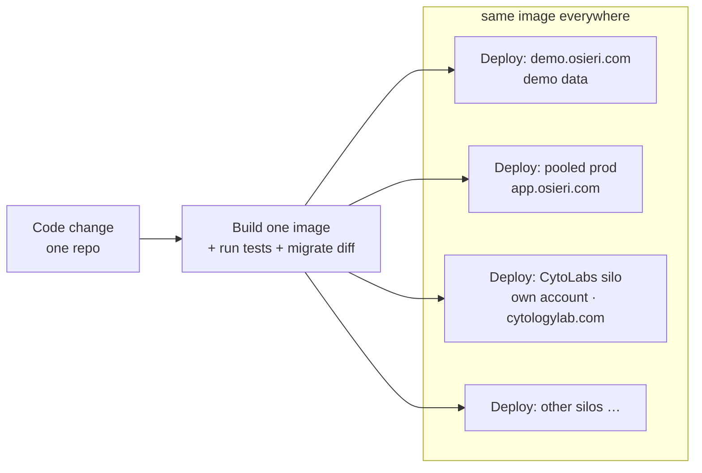

# Target platform architecture — Osieri at launch

**Status:** Accepted (direction) · **Date:** 2026-07-20 · **Owner:** platform

The blueprint for how Osieri runs at launch: one multi-tenant platform for laboratories, a
sales demo, physically-isolated "silo" labs (starting with CytoLabs), a cross-lab control plane,
and a single release pipeline that keeps them all on the same code.

Companions: [`HYBRID_TENANCY_AND_CUSTOM_DOMAINS.md`](./HYBRID_TENANCY_AND_CUSTOM_DOMAINS.md) ·
[`../migration/CUTOVER_RUNBOOK.md`](../migration/CUTOVER_RUNBOOK.md) ·
[`../DATA_MIGRATION_PLAN.md`](../DATA_MIGRATION_PLAN.md).

---

## 1. One codebase, many environments

There is **one** Osieri codebase and **one** container image per release. It is deployed to
several environments, each a tenant of the same product:

| Environment | Purpose | Data | Domain |
|---|---|---|---|
| **Demo** | Sales demos + QA of the latest build | Demo/seed content (never real PHI) | `demo.osieri.com` |
| **Pooled prod** | Most labs — shared deployment + shared DB, isolated by `labId` | Real PHI, many labs | `app.osieri.com` (+ per-lab subdomains) |
| **Silo labs** | Labs that require physical isolation (CytoLabs first) — own account/DB (and own app deployment) | Real PHI, one lab per DB | Lab's own domain (`cytologylab.com`) |

**Key rule:** the codebase is the single source of truth. The demo is a *showcase of the latest
build*, **not** a master that pushes updates to labs. Updates reach every environment because the
**release pipeline deploys the same image to all of them** — see §4.

## 2. Tenancy: pool + silo

Isolation is `labId` on every tenant-owned row, enforced fail-closed by `LabContext`
(AsyncLocalStorage) + the Prisma extension. Two placements (full detail in the tenancy doc):

- **POOL** — clinical data in the shared prod DB, isolated by `labId` (default; most labs).
- **SILO** — clinical data in the lab's **own dedicated database** (still `labId`-governed).
  CytoLabs is the first silo, in **its own GCP account**, with its own domain.

Same governance everywhere; we fork the *connection*, not the *rules*.

## 3. Control plane vs data plane

- **Control plane** — the small, always-shared directory: which labs exist, each lab's
  `tenancyMode`, DB secret reference, domain(s), and platform-level monitoring. Home of the
  **Control Center** (superuser god-view). Lives in the shared/pool database's non-tenant space.
- **Data plane** — each lab's clinical data (pool DB or silo DB).

### Control Center reach
- **Pooled labs:** monitored directly (one DB, query across `labId`). ✅ built.
- **Silo labs (own account/DB):** the Control Center cannot see them for free. Needs **cross-lab
  telemetry** — either the control plane queries the silo DB (cross-account/private connection) or
  each silo instance **reports health/metrics up** to the control plane. ⚠️ to build (tenancy doc §6).

### Role-gated navigation
Control-plane surfaces (features, modules, security, cross-lab admin, etc.) render **only** for
superusers/Control-Center roles. Lab users never see control-plane nav — the lab-facing app is a
strict subset. (The Control Center already sits behind its own gate/login.)

### Feature flags & config across silos
A lab's **feature flags (`LabFeature`) and per-lab config are control-plane data** — they describe
*how a lab is set up*, not its clinical data. So every lab, **pooled or silo, appears in the Control
Center list and its features are toggled there**.

Design rule that makes this work for silos: **store/resolve feature flags in the control plane, not
inside each lab's data-plane DB.**
- **Pooled labs:** flags already live centrally → toggling is instant.
- **Silo labs (own DB/account):** if flags lived only in the silo DB, the Control Center couldn't
  reach them across accounts. Instead the control plane owns the flags and each silo instance
  **reads its flags from the control plane (fetch + cache)**. One toggle then drives every lab
  uniformly.

This rides the **same control-plane↔silo channel** as cross-account telemetry (§3, §6): until that
channel exists, silo-in-own-account toggles don't propagate. Build `LabFeature` as control-plane
config that silos read centrally, and feature management is identical for pooled and silo labs.

**Already built (audited 2026-07-20):** for POOLED labs this fully works today.
- Control Center → **Features** (`/superuser/features`) lists **all labs** (`/lab-features/all-labs`),
  offers a **lab selector**, toggles a feature **per selected lab** (`PATCH /lab-features/:key {labId}`),
  and shows per-lab `isActive / online / activeSessions`.
- **Role-gating is correct with defense-in-depth:** nav filters by `can(permission)`; the
  control-plane surfaces (Modules/Features, Security, System Health, Superuser) require
  `system:health` / `system:security`, which are granted to **no default role** (superuser-bypass
  only); the API guards each endpoint; and the pages themselves redirect non-superusers.
- **Silo-readiness (the only remaining piece, lands with the Phase-D silo channel):** keep
  `LabFeature` on the **pool (control-plane) client** even for SILO labs — i.e. `ConnectionManager`
  routes `LabFeature` to the pool, and each silo instance reads its flags from the control plane.

## 4. Release pipeline — how "updates reach everyone"



- **Build once** → test → produce one image + run DB migrations (`prisma migrate deploy`, now
  clean from empty).
- **Deploy to all targets** — demo, pooled prod, and each silo (including labs in their own
  accounts). A silo in its own account is a deploy *target*, reached with that account's
  credentials; it is not skipped.
- This is what makes updates "automatic" for silos: **the pipeline pushes the same build to them**,
  not a shared running instance. Promote demo→prod as one gate.

## 5. The load-bearing decision (per silo)

Does a silo lab run **its own app deployment** or just **its own database**?

| | Own account + own app deployment | Shared app + siloed DB |
|---|---|---|
| Isolation | Maximum (their account, app, DB) | DB isolated; app runs centrally |
| Updates | Pipeline deploys to each target | One deploy updates all at once |
| Control Center | Needs cross-account telemetry | App already reaches the silo DB |
| Ops cost | Higher (N deployments) | Lower |

**CytoLabs = own account + own app deployment** (left column): maximum isolation, updates via the
pipeline. Legitimate and common for regulated single-tenant instances; costs a bit more deploy/ops
and the cross-account telemetry work.

## 6. Built vs. to-build

**Built:** multi-tenant `labId` isolation; Control Center (pooled) + its gate; the tenancy/silo
design; the legacy→Osieri ETL; the demo dataset.

**To build for launch:**
1. **App deployment** — containerize `apps/web` + `apps/api`; host (Cloud Run recommended);
   secrets; per-env config. (Data migration is solved; app hosting is new.)
2. **CI/CD release pipeline** — build one image → deploy to demo + pooled prod + each silo.
3. **Cross-account silo channel** — control-plane↔silo link that carries both **telemetry** (so
   Control Center monitors silos) and **config/feature flags** (so Control Center toggles silo
   features); `LabFeature` resolved from the control plane.
4. **Custom-domain routing** — Host→lab resolution, managed SSL (tenancy doc §5).
5. **Role-gated nav audit** — ensure no control-plane surface leaks to lab roles.

## 7. Launch shape (summary)

```
                 ┌──────────────── Control Center (superuser) ────────────────┐
                 │  directory of labs · tenancyMode · domains · monitoring     │
                 └───────▲───────────────────────▲──────────────────▲─────────┘
                         │ (labId queries)        │ (telemetry)       │
        ┌────────────────┴───────┐        ┌───────┴────────┐   ┌──────┴────────────┐
        │  Pooled prod (shared)  │        │ CytoLabs silo  │   │  Demo              │
        │  app.osieri.com        │        │ own GCP acct   │   │  demo.osieri.com   │
        │  many labs, 1 DB       │        │ own DB+domain  │   │  demo data         │
        └────────────────────────┘        └────────────────┘   └───────────────────┘
                 ▲                                 ▲                     ▲
                 └───────── same image, deployed by ONE release pipeline ┘
```
