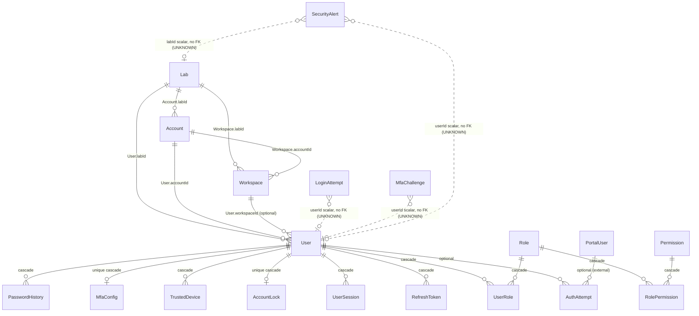
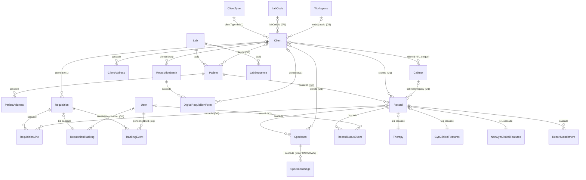
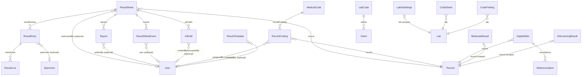
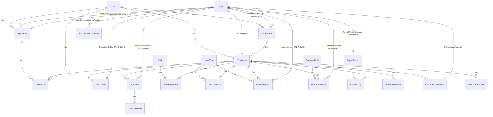

# PathOS Enterprise Domain Entity Model

**Purpose:** The canonical reference for every persistent domain entity implemented in PathOS/CYTOLAB. It is an **extraction** of the current source — the Prisma schema (`apps/api/prisma/schema.prisma`) and the backend owner modules (`apps/api/src/modules/*`). It documents only what is **proven by source**. Relationships, ownership, aggregate boundaries, and permissions are never inferred; where a fact cannot be proven from source it is marked **UNKNOWN**.

**Status:** Documentation only — an extracted reference, not a design. It redesigns nothing, changes no schema, and authorizes no code change.
**Scope:** 127 persistent Prisma models across 61 backend modules, as they exist in the working tree at extraction time.
**Method:** Each entity's owner was proven by locating the module service that reads/writes `prisma.<model>`. Relationships are taken only from Prisma `@relation` fields. Read/mutation APIs are controller routes; permission gates are `@RequirePermissions('...')` decorators (or a documented guard); events are `RealtimeGateway` emits or dedicated event tables. Cardinality is stated only where a Prisma relation proves it.

> **Reading the "UNKNOWN" marks.** Two kinds appear. (1) *Existence UNKNOWN* — a scalar id field (e.g. `userId String`) with **no** Prisma `@relation`, so the ORM does not prove the link (e.g. `LoginAttempt.userId`, `Appointment.resultRecordId`, polymorphic `Notification.entityId/entityType`). (2) *Cardinality UNKNOWN* — a relation whose FK side is a provable many-to-one but whose referenced model does not restate the inverse cardinality; the relationship **exists**, only its inverse multiplicity is left conservative. The Global Summary separates the two.

---

## How this document is organized

Entities are grouped into six bounded-context clusters. Each cluster lists its entities in the presentation format (Purpose · Owner · Aggregate · Relationships · Primary Identifier · Read Surface · Mutation Surface · Permissions · Events · Shared Contracts · Not Owned · Authoritative Sources) and closes with a Mermaid ER diagram of only the proven relationships in that cluster.

1. Identity, Access, Tenancy & Security
2. Patients, Clients, Requisitions, Records & Specimens
3. Results, Reporting, Coding, AI & Imaging
4. Billing, Portal, Collaboration & Content
5. Workforce, HR & Payroll
6. Quality, Operations, Interoperability & System Support

The Global Summary and Validation Rules follow the clusters.

---

# 1. Identity, Access, Tenancy & Security

Owning modules: `lab`, `auth`, `workspaces`, `users`, `roles`, `security`, `portal/auth`. Tenancy anchors on `Lab`; RBAC keys off `Permission` codes + `isSuperRole`; security lifecycle (sessions, locks, MFA, alerts) is owned by `security`.

### Lab
- **Purpose:** Tenant root — a laboratory's identity, branding (name/slug/logo/tagline), contact details, currency, and analytics targets; the `labId` anchor for tenancy.
- **Owner:** lab (source: apps/api/src/modules/lab/lab.service.ts); created by auth on tenant bootstrap (auth/auth.service.ts:88).
- **Aggregate Root:** Lab (top-level parent of many models; relations are plain lists, no `onDelete` cascade declared).
- **Primary Identifier:** `id` (`@id @default(uuid())`); `slug` `@unique`.
- **Parent Aggregate:** None (top-level).
- **Child Entities:** Within this set — `accounts Account[]`, `users User[]`, `workspaces Workspace[]` (plus dozens of models outside this set).
- **Direct Relationships:** `Account.labId → Lab` (Lab has many Account); `Workspace.labId → Lab` (Lab has many Workspace); `User.labId → Lab` (Lab has many User).
- **Lifecycle Owner:** lab.service.ts (`updateProfile`, `uploadLogo`, `removeLogo`); create in auth.service.ts `registerLab`.
- **Read APIs:** GET /lab/branding; GET /lab/profile
- **Mutation APIs:** PUT /lab/profile; POST /lab/logo; DELETE /lab/logo
- **Permission Gates:** /lab/branding = none (auth-only); GET /lab/profile = `applicationprefs:view`; PUT /lab/profile, POST/DELETE /lab/logo = `applicationprefs:change`.
- **Events Emitted:** `emitToLab(labId, 'lab:branding-updated', …)` on profile/logo mutation (lab.service.ts:43).
- **Shared Contracts:** `UpdateLabProfileDto` (lab/dto/lab.dto.ts); `RegisterLabDto` (auth/dto/login.dto.ts).
- **Not Owned:** All non-branding child models (patients, records, billing, etc.) owned by their own modules.
- **Authoritative Sources:** schema.prisma:173; lab/lab.controller.ts; lab.service.ts; auth/auth.service.ts:88

### Account
- **Purpose:** An organizational account within a lab; groups workspaces and users under a lab.
- **Owner:** auth (bootstrap create only — auth.service.ts:89); read-only lookups in users and workspaces. No dedicated CRUD module — owner UNKNOWN for lifecycle beyond creation.
- **Aggregate Root:** None (parent is Lab, but no cascade declared).
- **Primary Identifier:** `id` (`@id @default(uuid())`).
- **Parent Aggregate:** `Account.labId → Lab` (many-to-one).
- **Child Entities:** `users User[]`, `workspaces Workspace[]`.
- **Direct Relationships:** `Account.labId → Lab` (many-to-one); `User.accountId → Account` (Account has many User); `Workspace.accountId → Account` (Account has many Workspace).
- **Lifecycle Owner:** create only in auth.service.ts:89 (`registerLab`); no update/delete path found.
- **Read APIs:** None found (internal `account.findFirst` in users.service.ts:46, workspaces.service.ts:44).
- **Mutation APIs:** None found.
- **Permission Gates:** None found (no controller).
- **Events Emitted:** None found.
- **Shared Contracts:** None (no DTO).
- **Not Owned:** User and Workspace (own modules).
- **Authoritative Sources:** schema.prisma:274; auth/auth.service.ts:89; users/users.service.ts:46; workspaces/workspaces.service.ts:44

### Workspace
- **Purpose:** A department/branch within a lab account; groups users, requisitions, records, and clients.
- **Owner:** workspaces (source: apps/api/src/modules/workspaces/workspaces.service.ts).
- **Aggregate Root:** None (parent Lab/Account, no cascade declared).
- **Primary Identifier:** `id` (`@id @default(uuid())`); `@@index([accountId])`.
- **Parent Aggregate:** `Workspace.labId → Lab` (many-to-one); `Workspace.accountId → Account` (many-to-one).
- **Child Entities:** `users User[]`, `requisitions Requisition[]`, `records Record[]`, `clients Client[]` (last three outside this set).
- **Direct Relationships:** `Workspace.labId → Lab`; `Workspace.accountId → Account`; `User.workspaceId → Workspace` (optional; Workspace has many User).
- **Lifecycle Owner:** workspaces.service.ts (`create`, `update`, `remove` — remove blocked while users/records/clients reference it).
- **Read APIs:** GET /workspaces; GET /workspaces/:id
- **Mutation APIs:** POST /workspaces; PUT /workspaces/update/:id; DELETE /workspaces/delete/:id
- **Permission Gates:** `workspace:view`; `workspace:create`; `workspace:change`; `workspace:delete`.
- **Events Emitted:** None found.
- **Shared Contracts:** `CreateWorkspaceDto`, `UpdateWorkspaceDto`, `WorkspaceQueryDto` (workspaces/dto/workspace.dto.ts).
- **Not Owned:** Requisition, Record, Client (own modules).
- **Authoritative Sources:** schema.prisma:285; workspaces/workspaces.controller.ts; workspaces.service.ts

### User
- **Purpose:** A staff user of a lab — credentials, name, active flag, signature/designation, and enterprise-security lifecycle fields (password expiry, MFA-required, failed-login counters).
- **Owner:** users (source: apps/api/src/modules/users/users.service.ts); security fields co-written by auth and security (login-protection.service.ts, security.service.ts).
- **Aggregate Root:** User (cascade-owns UserRole, RefreshToken, UserSession, AccountLock, TrustedDevice, MfaConfig, PasswordHistory).
- **Primary Identifier:** `id` (`@id @default(uuid())`); `@@unique([labId, email])`.
- **Parent Aggregate:** `User.labId → Lab`; `User.accountId → Account`; `User.workspaceId → Workspace?` (optional).
- **Child Entities (this set, cascade):** `roles UserRole[]`, `refreshTokens RefreshToken[]`, `userSessions UserSession[]`, `accountLock AccountLock?`, `trustedDevices TrustedDevice[]`, `mfaConfig MfaConfig?`, `passwordHistory PasswordHistory[]`, `authAttempts AuthAttempt[]` (plus many domain relations outside set).
- **Direct Relationships:** `User.labId → Lab`, `User.accountId → Account`, `User.workspaceId → Workspace?` (many-to-one); `UserRole.userId → User` (Cascade, 1-many); `AuthAttempt.userId → User?` (optional, 1-many); `RefreshToken.userId → User` (Cascade); `UserSession.userId → User` (Cascade); `AccountLock.userId → User` (`@unique`, Cascade, 1-1); `TrustedDevice.userId → User` (Cascade); `MfaConfig.userId → User` (`@unique`, Cascade, 1-1); `PasswordHistory.userId → User` (Cascade).
- **Lifecycle Owner:** users.service.ts (`create`, `update`, `setActive`, `changePassword`, `saveMySignature`); create also in auth.service.ts `registerLab`; security-field mutation in auth + security services.
- **Read APIs:** GET /users; GET /users/:id; GET /users/me/signature; GET /auth/me
- **Mutation APIs:** POST /users; PUT /users/:id; PATCH /users/:id/access; PUT /users/me/signature; PUT /users/password/change; POST /auth/change-password
- **Permission Gates:** `user:view` (GET /users, /users/:id); `user:create` (POST); `user:change` (PUT /users/:id, PATCH access); signature + password routes = none (self-service).
- **Events Emitted:** None found.
- **Shared Contracts:** `CreateUserDto`, `UpdateUserDto`, `ChangePasswordDto`, `SaveSignatureDto` (users/dto/user.dto.ts); `userSelect` projection.
- **Not Owned:** Security child records' admin lifecycle (security module); Role/Permission definitions (roles module).
- **Authoritative Sources:** schema.prisma:302; users/users.controller.ts; users.service.ts; auth/auth.service.ts; security/*

### Role
- **Purpose:** A named RBAC role; `isSuperRole` bypasses permission checks; `scope` (User/Workspace) preserved but Workspace-enforcement deferred.
- **Owner:** roles (source: apps/api/src/modules/roles/roles.service.ts).
- **Aggregate Root:** Role (cascade-owns UserRole and RolePermission join rows).
- **Primary Identifier:** `id` (`@id @default(uuid())`); `name` `@unique`.
- **Parent Aggregate:** None.
- **Child Entities:** `users UserRole[]`, `permissions RolePermission[]`.
- **Direct Relationships:** `UserRole.roleId → Role` (Cascade, 1-many); `RolePermission.roleId → Role` (Cascade, 1-many).
- **Lifecycle Owner:** roles.service.ts (`createRole`, `updateRole`, `deleteRole`; nested create/deleteMany of RolePermission).
- **Read APIs:** GET /roles
- **Mutation APIs:** POST /roles; PUT /roles/:id; DELETE /roles/:id
- **Permission Gates:** GET /roles = `role:view`; POST = `permission:create`; PUT = `permission:change`; DELETE = `permission:delete`.
- **Events Emitted:** None found.
- **Shared Contracts:** `RoleBody` interface (roles.service.ts).
- **Not Owned:** User (assignment via UserRole also written from users.service.ts).
- **Authoritative Sources:** schema.prisma:396; roles/roles.controller.ts; roles.service.ts

### Permission
- **Purpose:** A permission definition (`code` + human `label`) referenced by roles.
- **Owner:** roles (source: roles.service.ts — read-only `findPermissions`).
- **Aggregate Root:** Permission (cascade-owns RolePermission on the permission side).
- **Primary Identifier:** `id` (`@id @default(uuid())`); `code` `@unique`.
- **Parent Aggregate:** None.
- **Child Entities:** `roles RolePermission[]`.
- **Direct Relationships:** `RolePermission.permissionId → Permission` (Cascade, 1-many).
- **Lifecycle Owner:** None found (no create/update/delete of Permission in source — only `findMany`); seeding presumed elsewhere (UNKNOWN).
- **Read APIs:** GET /permissions
- **Mutation APIs:** None found.
- **Permission Gates:** GET /permissions = `permission:view`.
- **Events Emitted:** None found.
- **Shared Contracts:** None (exposed as raw model).
- **Not Owned:** Role assignments (RolePermission written by roles.service.ts).
- **Authoritative Sources:** schema.prisma:417; roles/roles.controller.ts:18; roles.service.ts:24

### UserRole
- **Purpose:** Join row assigning a Role to a User.
- **Owner:** users + roles (nested Prisma relation ops in users.service.ts and roles.service.ts; no direct `prisma.userRole` calls).
- **Aggregate Root:** User / Role (both parents Cascade).
- **Primary Identifier:** `@@id([userId, roleId])` (composite).
- **Parent Aggregate:** `UserRole.userId → User` (Cascade); `UserRole.roleId → Role` (Cascade).
- **Child Entities:** None.
- **Direct Relationships:** `UserRole.userId → User` (many-to-one, Cascade); `UserRole.roleId → Role` (many-to-one, Cascade).
- **Lifecycle Owner:** users.service.ts (`create`/`update` nested `roles: { create/deleteMany }`); roles.service.ts.
- **Read APIs:** None found (embedded in user/role responses).
- **Mutation APIs:** None found (managed via POST/PUT /users with `roleIds`).
- **Permission Gates:** Inherited from /users routes (`user:create`/`user:change`).
- **Events Emitted:** None found.
- **Shared Contracts:** `roleIds` field on `CreateUserDto`/`UpdateUserDto`.
- **Not Owned:** —
- **Authoritative Sources:** schema.prisma:424; users/users.service.ts:56-79; roles/roles.service.ts

### RolePermission
- **Purpose:** Join row granting a Permission to a Role.
- **Owner:** roles (nested relation ops in roles.service.ts).
- **Aggregate Root:** Role / Permission (both parents Cascade).
- **Primary Identifier:** `@@id([roleId, permissionId])` (composite).
- **Parent Aggregate:** `RolePermission.roleId → Role` (Cascade); `RolePermission.permissionId → Permission` (Cascade).
- **Child Entities:** None.
- **Direct Relationships:** `RolePermission.roleId → Role` (many-to-one, Cascade); `RolePermission.permissionId → Permission` (many-to-one, Cascade).
- **Lifecycle Owner:** roles.service.ts (`createRole`/`updateRole` nested `permissions: { create/deleteMany }`).
- **Read APIs:** None found (embedded).
- **Mutation APIs:** None found (managed via POST/PUT /roles with `permissionIds`).
- **Permission Gates:** Inherited from /roles routes (`permission:create`/`permission:change`).
- **Events Emitted:** None found.
- **Shared Contracts:** `permissionIds` field on `RoleBody`.
- **Not Owned:** —
- **Authoritative Sources:** schema.prisma:433; roles/roles.service.ts:36-61

### AuthAttempt
- **Purpose:** Legacy login-attempt audit row (email/ip/success) for staff or portal, keyed to a user or portal user; used for portal lockout counting and system-log feed.
- **Owner:** portal (writer: portal/auth/portal-auth.service.ts); read by system (system-log.service.ts). Staff-side writer not found — owner effectively portal.
- **Aggregate Root:** None.
- **Primary Identifier:** `id` (`@id @default(uuid())`); `@@index([email, createdAt])`, `@@index([portal, email, createdAt])`.
- **Parent Aggregate:** `AuthAttempt.userId → User?` (optional); `AuthAttempt.portalUserId → PortalUser?` (optional, outside set).
- **Child Entities:** None.
- **Direct Relationships:** `AuthAttempt.userId → User?` (optional many-to-one); `AuthAttempt.portalUserId → PortalUser?` (optional many-to-one).
- **Lifecycle Owner:** portal-auth.service.ts:73 (`authAttempt.create`); count at :53.
- **Read APIs:** GET /system/logs (aggregated feed)
- **Mutation APIs:** None found (created internally on portal login).
- **Permission Gates:** GET /system/logs = `system:health`.
- **Events Emitted:** None found.
- **Shared Contracts:** Surfaced in system log `LogEntry` shape (system-log.service.ts).
- **Not Owned:** PortalUser (portal module).
- **Authoritative Sources:** schema.prisma:442; portal/auth/portal-auth.service.ts:53,73; system/system-log.service.ts:77

### RefreshToken
- **Purpose:** A hashed opaque refresh token bound to a device/session; supports rotation and revocation.
- **Owner:** security (source: security/session.service.ts).
- **Aggregate Root:** User (parent Cascade).
- **Primary Identifier:** `id` (`@id @default(cuid())`); `token` `@unique`; `@@index([userId])`, `@@index([token])`.
- **Parent Aggregate:** `RefreshToken.userId → User` (Cascade, many-to-one).
- **Child Entities:** None.
- **Direct Relationships:** `RefreshToken.userId → User` (many-to-one, Cascade).
- **Lifecycle Owner:** session.service.ts (`create` :80; rotate/revoke :134,:174,:188,:211).
- **Read APIs:** None found (server-side only; rotated via POST /auth/refresh, revoked via POST /auth/logout).
- **Mutation APIs:** None found direct (managed inside /auth/refresh and /auth/logout).
- **Permission Gates:** None (internal).
- **Events Emitted:** None found.
- **Shared Contracts:** None.
- **Not Owned:** —
- **Authoritative Sources:** schema.prisma:3455; security/session.service.ts:80

### UserSession
- **Purpose:** A tracked login session (one per device) with geo/device metadata; powers the Security Center session list, idle timeout, impossible-travel detection.
- **Owner:** security (source: security/session.service.ts, security.service.ts).
- **Aggregate Root:** User (parent Cascade).
- **Primary Identifier:** `id` (`@id @default(cuid())`); `@@index([userId])`.
- **Parent Aggregate:** `UserSession.userId → User` (Cascade, many-to-one).
- **Child Entities:** None.
- **Direct Relationships:** `UserSession.userId → User` (many-to-one, Cascade).
- **Lifecycle Owner:** session.service.ts (`create` :57; updates :127,:156,:170,:189,:215); admin terminate in security.service.ts.
- **Read APIs:** GET /auth/sessions (admin); GET /auth/profile/sessions (self)
- **Mutation APIs:** DELETE /auth/sessions/:id; POST /auth/users/:id/terminate-sessions; POST /auth/profile/sessions/terminate-others
- **Permission Gates:** /auth admin routes = `system:security` (class-level); /auth/profile routes = none (self-service).
- **Events Emitted:** None found.
- **Shared Contracts:** None (raw model / session lists).
- **Not Owned:** RefreshToken (paired but its own model).
- **Authoritative Sources:** schema.prisma:3473; security/session.service.ts:57; auth-security-admin.controller.ts; profile-security.controller.ts

### LoginAttempt
- **Purpose:** Every staff login attempt (success/failure) with geo/device metadata; audit source for brute-force / credential-stuffing detection and login-history screen. Not tenant-scoped.
- **Owner:** security (source: security/login-protection.service.ts, security.service.ts).
- **Aggregate Root:** None.
- **Primary Identifier:** `id` (`@id @default(cuid())`); `@@index` on ipAddress, email, createdAt.
- **Parent Aggregate:** None. (`userId String?` is a scalar with NO Prisma `@relation` — link to User is **UNKNOWN**.)
- **Child Entities:** None.
- **Direct Relationships:** None proven (scalar `userId` only — UNKNOWN).
- **Lifecycle Owner:** login-protection.service.ts:61 (`loginAttempt.create`); read in security.service.ts (:37,:64,:65).
- **Read APIs:** GET /auth/login-attempts (admin); GET /auth/profile/login-history (self); GET /security/dashboard
- **Mutation APIs:** None found (created internally during login).
- **Permission Gates:** /auth/login-attempts = `system:security`; /security/dashboard = `system:security`; /auth/profile/login-history = none (self).
- **Events Emitted:** None found.
- **Shared Contracts:** None (raw model).
- **Not Owned:** —
- **Authoritative Sources:** schema.prisma:3497; security/login-protection.service.ts:61; security.service.ts; auth-security-admin.controller.ts:48; profile-security.controller.ts:35

### AccountLock
- **Purpose:** Active/historical account lock; auto-expiring (`autoUnlockAt`) or permanent (admin unlock required).
- **Owner:** security (source: security/login-protection.service.ts, security.service.ts).
- **Aggregate Root:** User (parent Cascade, one-to-one).
- **Primary Identifier:** `id` (`@id @default(cuid())`); `userId` `@unique`.
- **Parent Aggregate:** `AccountLock.userId → User` (`@unique`, Cascade, one-to-one).
- **Child Entities:** None.
- **Direct Relationships:** `AccountLock.userId → User` (one-to-one, Cascade).
- **Lifecycle Owner:** login-protection.service.ts (`upsert` :188, `update` :138, `updateMany` :266); admin unlock in security.service.ts:169.
- **Read APIs:** GET /auth/locked-users
- **Mutation APIs:** POST /auth/users/:id/unlock; POST /auth/users/:id/force-reset
- **Permission Gates:** `system:security` (class-level).
- **Events Emitted:** None found.
- **Shared Contracts:** None.
- **Not Owned:** —
- **Authoritative Sources:** schema.prisma:3522; security/login-protection.service.ts:188; security.service.ts:169; auth-security-admin.controller.ts:69-85

### TrustedDevice
- **Purpose:** A device the user completed MFA on; future logins from it skip MFA unless impossible travel is detected.
- **Owner:** security (source: security/login-protection.service.ts, security.service.ts).
- **Aggregate Root:** User (parent Cascade).
- **Primary Identifier:** `id` (`@id @default(cuid())`); `@@unique([userId, deviceId])`.
- **Parent Aggregate:** `TrustedDevice.userId → User` (Cascade, many-to-one).
- **Child Entities:** None.
- **Direct Relationships:** `TrustedDevice.userId → User` (many-to-one, Cascade).
- **Lifecycle Owner:** login-protection.service.ts:331 (`upsert`); revoke in security.service.ts:245.
- **Read APIs:** GET /auth/trusted-devices
- **Mutation APIs:** DELETE /auth/trusted-devices/:id
- **Permission Gates:** `system:security` (class-level).
- **Events Emitted:** None found.
- **Shared Contracts:** None.
- **Not Owned:** —
- **Authoritative Sources:** schema.prisma:3536; security/login-protection.service.ts:331; security.service.ts:245; auth-security-admin.controller.ts:118-129

### MfaConfig
- **Purpose:** Per-user MFA configuration (encrypted TOTP secret, hashed backup codes, email toggle). Missing row = MFA not configured.
- **Owner:** security (source: security/mfa.service.ts).
- **Aggregate Root:** User (parent Cascade, one-to-one).
- **Primary Identifier:** `id` (`@id @default(cuid())`); `userId` `@unique`.
- **Parent Aggregate:** `MfaConfig.userId → User` (`@unique`, Cascade, one-to-one).
- **Child Entities:** None.
- **Direct Relationships:** `MfaConfig.userId → User` (one-to-one, Cascade).
- **Lifecycle Owner:** mfa.service.ts (`upsert` :51,:110; `update` :68,:83,:168; `delete` :184); admin reset via security.service.ts.
- **Read APIs:** GET /auth/mfa/status (self); GET /security/mfa (admin overview)
- **Mutation APIs:** POST /auth/mfa/totp/setup; /totp/verify; /totp/disable; /email/send; /email/verify; PATCH /auth/users/:id/require-mfa; POST /auth/users/:id/reset-mfa
- **Permission Gates:** /auth/mfa self routes = none (auth-only); GET /security/mfa = `system:security`; require-mfa + reset-mfa = `system:security`.
- **Events Emitted:** None found.
- **Shared Contracts:** `MfaCodeDto`, `RequireMfaDto` (security/dto/security.dto.ts).
- **Not Owned:** MfaChallenge (separate model).
- **Authoritative Sources:** schema.prisma:3553; security/mfa.service.ts; mfa.controller.ts; auth-security-admin.controller.ts:87-97

### MfaChallenge
- **Purpose:** A pending MFA challenge (email OTP or step-up); `code` hashed for email OTP, `usedAt` marks consumption.
- **Owner:** security (source: security/mfa.service.ts).
- **Aggregate Root:** None (scalar `userId`, no Prisma relation).
- **Primary Identifier:** `id` (`@id @default(cuid())`).
- **Parent Aggregate:** None. (`userId String` scalar with NO `@relation` — link to User **UNKNOWN**.)
- **Child Entities:** None.
- **Direct Relationships:** None proven (scalar `userId` only — UNKNOWN).
- **Lifecycle Owner:** mfa.service.ts (`create` :107; `update` :132; `deleteMany` :185).
- **Read APIs:** None found (consumed internally).
- **Mutation APIs:** None found direct (issued/consumed via /auth/mfa/email/* and login /auth/mfa/challenge).
- **Permission Gates:** None (internal to auth/MFA flow).
- **Events Emitted:** None found.
- **Shared Contracts:** `MfaChallengeDto`, `MfaSendDto` (auth/dto/login.dto.ts).
- **Not Owned:** —
- **Authoritative Sources:** schema.prisma:3566; security/mfa.service.ts:107,132,185

### PasswordHistory
- **Purpose:** The last N password hashes per user, enforcing no-reuse on password change.
- **Owner:** security + auth (writers: security/password-policy.service.ts:119, auth/auth.service.ts:111,362).
- **Aggregate Root:** User (parent Cascade).
- **Primary Identifier:** `id` (`@id @default(cuid())`); `@@index([userId])`.
- **Parent Aggregate:** `PasswordHistory.userId → User` (Cascade, many-to-one).
- **Child Entities:** None.
- **Direct Relationships:** `PasswordHistory.userId → User` (many-to-one, Cascade).
- **Lifecycle Owner:** password-policy.service.ts:119 (`create`); auth.service.ts:111,362 (`create` on register + password change).
- **Read APIs:** None found (compared internally during change).
- **Mutation APIs:** None found direct (written during POST /auth/change-password and lab registration).
- **Permission Gates:** None (internal).
- **Events Emitted:** None found.
- **Shared Contracts:** None.
- **Not Owned:** —
- **Authoritative Sources:** schema.prisma:3577; security/password-policy.service.ts:119; auth/auth.service.ts:111,362

### BlockedIp
- **Purpose:** IP denylist entry — auto-added on credential stuffing (24h expiry) or manually by an admin (optionally permanent).
- **Owner:** security (source: security/login-protection.service.ts, security.service.ts).
- **Aggregate Root:** None (no relations).
- **Primary Identifier:** `id` (`@id @default(cuid())`); `ipAddress` `@unique`.
- **Parent Aggregate:** None.
- **Child Entities:** None.
- **Direct Relationships:** None (standalone model; no `@relation`).
- **Lifecycle Owner:** login-protection.service.ts:220 (`upsert`, auto-block); security.service.ts:207 (`upsert`, admin add), :228 (`delete`, unblock).
- **Read APIs:** GET /auth/blocked-ips
- **Mutation APIs:** POST /auth/blocked-ips; DELETE /auth/blocked-ips/:id
- **Permission Gates:** `system:security` (class-level).
- **Events Emitted:** None found.
- **Shared Contracts:** `AddBlockedIpDto` (security/dto/security.dto.ts).
- **Not Owned:** —
- **Authoritative Sources:** schema.prisma:3589; security/login-protection.service.ts:220; security.service.ts:207,228; auth-security-admin.controller.ts:99-116

### SecurityAlert
- **Purpose:** A raised security signal for the Security Center (IMPOSSIBLE_TRAVEL, BRUTE_FORCE, CREDENTIAL_STUFFING, etc.) with severity, resolution state. `labId`/`userId` nullable because some signals are pre-auth.
- **Owner:** security (source: security/login-protection.service.ts, security.service.ts).
- **Aggregate Root:** None (nullable scalar `labId`/`userId`, no Prisma relation).
- **Primary Identifier:** `id` (`@id @default(cuid())`); `@@index([createdAt])`, `@@index([resolved])`.
- **Parent Aggregate:** None. (`labId`/`userId` scalars with NO `@relation` — links **UNKNOWN**.)
- **Child Entities:** None.
- **Direct Relationships:** None proven (scalar `labId`, `userId` only — UNKNOWN).
- **Lifecycle Owner:** login-protection.service.ts:93 (`create`); security.service.ts:312 (`update` → resolve).
- **Read APIs:** GET /security/alerts; GET /security/dashboard (recent)
- **Mutation APIs:** PATCH /security/alerts/:id/resolve
- **Permission Gates:** `system:security` (class-level on SecurityController).
- **Events Emitted:** None found.
- **Shared Contracts:** None (raw model / filter query params).
- **Not Owned:** —
- **Authoritative Sources:** schema.prisma:3601; security/login-protection.service.ts:93; security.service.ts:304,312; security.controller.ts:28-50

### SystemConfig
- **Purpose:** Global key/value platform configuration (e.g. `password_policy`). Not tenant-scoped.
- **Owner:** security (source: security/password-policy.service.ts).
- **Aggregate Root:** None (no relations).
- **Primary Identifier:** `id` (`@id @default(cuid())`); `key` `@unique`.
- **Parent Aggregate:** None.
- **Child Entities:** None.
- **Direct Relationships:** None (standalone; no `@relation`).
- **Lifecycle Owner:** password-policy.service.ts (`findUnique` :48, `upsert` :56 — accessed via `(prisma as any).systemConfig`).
- **Read APIs:** GET /security/password-policy
- **Mutation APIs:** PATCH /security/password-policy
- **Permission Gates:** `system:security` (class-level).
- **Events Emitted:** None found.
- **Shared Contracts:** `UpdatePasswordPolicyDto` (security/dto/security.dto.ts).
- **Not Owned:** —
- **Authoritative Sources:** schema.prisma:3621; security/password-policy.service.ts:48,56; security.controller.ts:52-62

**Cluster 1 tally:** entities=20 · proven relationships=18 · UNKNOWN (existence)=4 · aggregate roots=4 (Lab, User, Role, Permission) · standalone (no aggregate)=8

---

# 2. Patients, Clients, Requisitions, Records & Specimens

Owning modules: `patients`, `clients`, `requisitions`, `records`, `req-tracking`, `cabinets`, `files`, `requisition-portal`. `Record` is the clinical composition root (see the Architecture Ledger). Human-facing identifiers are allocated via the shared `LabSequence` counter.

### Patient
- **Purpose:** Registered patient demographics (name, DOB, gender, contact, registrationNo) scoped per lab.
- **Owner:** patients (source: patients/patients.service.ts)
- **Aggregate Root:** Patient (Prisma parent of PatientAddress with `onDelete: Cascade`)
- **Primary Identifier:** `id String @id @default(uuid())`; `@@unique([labId, registrationNo])`
- **Parent Aggregate:** None (has optional `client Client?` via `clientId`)
- **Child Entities:** `addresses PatientAddress[]` (cascade); also `records Record[]`
- **Direct Relationships:** `lab Lab` (many→one); `client Client?` (many→0/1, optional); `addresses PatientAddress[]` (one→many); `records Record[]`, `appointments Appointment[]`, `correlationCases CorrelationCase[]`, `recalls RecallRecord[]` (one→many)
- **Lifecycle Owner:** patients.service.ts (create/update/delete, allocateSequence for registrationNo at 169)
- **Read APIs:** GET /patients/overview, /patients/search, /patients/client, /patients, /patients/:patientId/history, /patient/:id
- **Mutation APIs:** POST /patient; PUT /patient/update/:id; DELETE /patient/delete/:id
- **Permission Gates:** `patient:view`, `patient:create`, `patient:change`, `patient:delete`; history route `resultentry:view`
- **Events Emitted:** None found
- **Shared Contracts:** patients/dto/patient.dto.ts
- **Not Owned:** —
- **Authoritative Sources:** schema.prisma:462; patients/patients.service.ts, patients.controller.ts

### PatientAddress
- **Purpose:** One or more postal addresses for a Patient (label/line1/line2/city/region/postalCode/country).
- **Owner:** patients (nested `addresses` create, patients.service.ts:60,149)
- **Aggregate Root:** Patient
- **Primary Identifier:** `id String @id @default(uuid())`
- **Parent Aggregate:** Patient — `patient Patient @relation(onDelete: Cascade)` (many→one)
- **Child Entities:** None
- **Direct Relationships:** `lab Lab`; `patient Patient` (Cascade, many→one)
- **Lifecycle Owner:** patients.service.ts (`addressCreate` nested write; no standalone table access)
- **Read APIs:** None standalone (nested via patient reads)
- **Mutation APIs:** None standalone (via POST /patient, PUT /patient/update/:id)
- **Permission Gates:** Inherited (`patient:create`/`patient:change`)
- **Events Emitted:** None found
- **Shared Contracts:** patients/dto/patient.dto.ts
- **Not Owned:** —
- **Authoritative Sources:** schema.prisma:1265; patients/patients.service.ts

### ClientType
- **Purpose:** Named classification of clients (`name`, `type ClientTypeEnum`).
- **Owner:** clients (clients/clients.service.ts)
- **Aggregate Root:** None
- **Primary Identifier:** `id String @id @default(uuid())`
- **Parent Aggregate:** None
- **Child Entities:** `clients Client[]` (one→many)
- **Direct Relationships:** `lab Lab`; `clients Client[]`
- **Lifecycle Owner:** clients.service.ts (only writer)
- **Read APIs:** GET /client-types
- **Mutation APIs:** POST /client-types
- **Permission Gates:** `client:view` (read), `client:create` (create)
- **Events Emitted:** None found
- **Shared Contracts:** clients/dto/client.dto.ts
- **Not Owned:** —
- **Authoritative Sources:** schema.prisma:497; clients/clients.service.ts, clients.controller.ts

### Client
- **Purpose:** Referring client/practice account (names, accountNo, contact, active/blocked, labCode/workspace links).
- **Owner:** clients (clients/clients.service.ts) — read by cabinets, requisition-portal, portal-users, search, backup
- **Aggregate Root:** Client (parent of ClientAddress with cascade)
- **Primary Identifier:** `id String @id @default(uuid())`; `@@unique([labId, accountNo])`
- **Parent Aggregate:** None (optional links to LabCode, Workspace, ClientType)
- **Child Entities:** `addresses ClientAddress[]` (cascade)
- **Direct Relationships:** `lab Lab`; `labCode LabCode?`, `workspace Workspace?`, `clientType ClientType?` (many→0/1 each); `patients`, `requisitions`, `records`, `specimens`, `cabinets`, `bills`, `addresses`, `portalUsers`, `threads`, `appointments`, `requisitionBatches`, `digitalRequisitionForms` (one→many)
- **Lifecycle Owner:** clients.service.ts (create/update/delete; allocateSequence for accountNo at 61)
- **Read APIs:** GET /clients, /client/:id
- **Mutation APIs:** POST /client; PUT /client/update/:id; DELETE /client/delete/:id
- **Permission Gates:** `client:view`, `client:create`, `client:change`, `client:delete`
- **Events Emitted:** None found
- **Shared Contracts:** clients/dto/client.dto.ts
- **Not Owned:** —
- **Authoritative Sources:** schema.prisma:509; clients/clients.service.ts, clients.controller.ts

### ClientAddress
- **Purpose:** One or more addresses for a Client.
- **Owner:** clients (nested `addresses` create, clients.service.ts:36,139)
- **Aggregate Root:** Client
- **Primary Identifier:** `id String @id @default(uuid())`
- **Parent Aggregate:** Client — `client Client @relation(onDelete: Cascade)` (many→one)
- **Child Entities:** None
- **Direct Relationships:** `lab Lab`; `client Client` (Cascade)
- **Lifecycle Owner:** clients.service.ts (`addressCreate` nested write)
- **Read APIs:** None standalone (nested)
- **Mutation APIs:** None standalone (via POST /client, PUT /client/update/:id)
- **Permission Gates:** Inherited (`client:create`/`client:change`)
- **Events Emitted:** None found
- **Shared Contracts:** clients/dto/client.dto.ts
- **Not Owned:** —
- **Authoritative Sources:** schema.prisma:1287; clients/clients.service.ts

### Requisition
- **Purpose:** Batch request (referenceNo, status, amount) grouping requisition lines from a client.
- **Owner:** requisitions (requisitions/requisitions.service.ts) — also written by records, req-tracking, requisition-portal
- **Aggregate Root:** Requisition (parent of RequisitionLine with cascade; owns RequisitionTracking 1:1)
- **Primary Identifier:** `id String @id @default(uuid())`; `@@unique([labId, referenceNo])`
- **Parent Aggregate:** None (optional `client`, `workspace`)
- **Child Entities:** `lines RequisitionLine[]` (cascade), `tracking RequisitionTracking?` (1:1), `trackingEvents TrackingEvent[]`
- **Direct Relationships:** `lab Lab`; `client Client?`, `workspace Workspace?`; `lines RequisitionLine[]` (one→many); `tracking RequisitionTracking?` (one→0/1); `trackingEvents TrackingEvent[]` (one→many)
- **Lifecycle Owner:** requisitions.service.ts (create/delete; allocateSequence for referenceNo at 234); status recompute from lines
- **Read APIs:** GET /requisitions, /requisitions/report, /requisitions/client/:clientId, /requisitions/:id
- **Mutation APIs:** POST /requisition/create; DELETE /requisition/delete/:id; DELETE /requisition/item/delete/:id
- **Permission Gates:** `requisition:view` (reads), `requisition:create` (create/deletes)
- **Events Emitted:** requisitions.service.ts:214 `emitToLab(labId, 'specimen:new', …)`; :218 `emitToLab(labId, 'dashboard:refresh', …)`
- **Shared Contracts:** requisitions/dto/requisition.dto.ts
- **Not Owned:** —
- **Authoritative Sources:** schema.prisma:564; requisitions/requisitions.service.ts, requisitions.controller.ts

### RequisitionLine
- **Purpose:** A single test line on a requisition (formType, isUrgent, isCompleted, amount, optional linked record).
- **Owner:** requisitions (requisitions.service.ts) — also read/written by records, requisition-portal
- **Aggregate Root:** Requisition
- **Primary Identifier:** `id String @id @default(uuid())`
- **Parent Aggregate:** Requisition — `requisition Requisition @relation(onDelete: Cascade)` (many→one)
- **Child Entities:** None
- **Direct Relationships:** `lab Lab`; `requisition Requisition` (Cascade); `record Record?` (many→0/1)
- **Lifecycle Owner:** requisitions.service.ts (line create/delete); isCompleted updated by records.service.ts on record fulfillment
- **Read APIs:** None standalone (nested)
- **Mutation APIs:** DELETE /requisition/item/delete/:id; created via POST /requisition/create
- **Permission Gates:** `requisition:create`
- **Events Emitted:** None found
- **Shared Contracts:** requisitions/dto/requisition.dto.ts
- **Not Owned:** Record lifecycle (only references it)
- **Authoritative Sources:** schema.prisma:592; requisitions/requisitions.service.ts, records/records.service.ts

### Record
- **Purpose:** Core cytology case (identifier, labNumber, formType, doctor, status, patient/client links).
- **Owner:** records (records/records.service.ts) — read/written by many downstream modules
- **Aggregate Root:** Record (parent with cascade over Specimen, RecordStatusEvent, Therapy, Gyn/NonGyn features, RecordAttachment)
- **Primary Identifier:** `id String @id @default(uuid())`; `@@unique([labId, identifier])`, `@@unique([labId, labNumber])`
- **Parent Aggregate:** None (many→one Patient; optional Client/Workspace/Cabinet/assignedTo)
- **Child Entities:** `specimens Specimen[]`, `statusHistory RecordStatusEvent[]`, `therapy Therapy?`, `gynFeatures GynClinicalFeatures?`, `nonGynFeatures NonGynClinicalFeatures?`, `attachments RecordAttachment[]` (all cascade); plus many non-owned relations
- **Direct Relationships:** `patient Patient` (many→one, required); `client Client?`, `workspace Workspace?`, `cabinet Cabinet?`, `assignedTo User?` (many→0/1); `requisitionLines RequisitionLine[]` (one→many); cascade children above; plus reference relations `resultSheets`, `bethesdaResult?`, `tatAlerts`, `escalations`, `qcChecks`, `cytologyCorrelations`, `reagentUsages`, `recalls`, `digitalSlides`, `aiScreening?`, `consultRequests`, `codings`, `fhirTransmissions`, `bills`, `changeRequests`
- **Lifecycle Owner:** records.service.ts (create ~239, status transitions with ALLOWED_TRANSITIONS ~100, allocateSequence for labNumber at 445, delete)
- **Read APIs:** GET /specimens, /specimens/:id, /specimens/approved, /billable, /client, /patient, /recent, /requisition, /records/my-queue, /records/batch-labels, /records/:id/label
- **Mutation APIs:** POST /specimen/create; PUT /specimen/update/:id; PUT /specimen/submit/:id; PATCH /specimen/status/:id; PATCH /records/bulk-assign; PATCH /records/:id/assign; DELETE /specimen/delete/:id
- **Permission Gates:** `record:view`, `record:create`, `record:change`, `record:submit`, `recordstatus:change`, `bill:view`
- **Events Emitted:** None found directly in records.service.ts (requisitions.service emits `specimen:new` on requisition create)
- **Shared Contracts:** records/dto/record.dto.ts (incl. UpdateRecordStatusDto)
- **Not Owned:** ResultSheet, Bill, TATAlert, QCCheck, AIScreeningResult, etc. (reference Record; owned elsewhere)
- **Authoritative Sources:** schema.prisma:615; records/records.service.ts, records.controller.ts

### RecordStatusEvent
- **Purpose:** Append-only status-history entry per record (status, userId, notes) feeding portal status timeline.
- **Owner:** records (nested `statusHistory.create`, records.service.ts:245-246,518-519) — read by patients, qc, analytics, system-log
- **Aggregate Root:** Record
- **Primary Identifier:** `id String @id @default(uuid())`
- **Parent Aggregate:** Record — `record Record @relation(onDelete: Cascade)` (many→one)
- **Child Entities:** None
- **Direct Relationships:** `lab Lab`; `record Record` (Cascade); `user User?` (many→0/1)
- **Lifecycle Owner:** records.service.ts (created on record create and status change); append-only
- **Read APIs:** None standalone (nested via record reads; patient history)
- **Mutation APIs:** None standalone (written via record create / PATCH /specimen/status/:id)
- **Permission Gates:** Inherited (`recordstatus:change`)
- **Events Emitted:** Dedicated append-only status-history table
- **Shared Contracts:** records/dto/record.dto.ts
- **Not Owned:** —
- **Authoritative Sources:** schema.prisma:687; records/records.service.ts

### Specimen
- **Purpose:** Physical specimen/material on a record (label, vialColour, antisera, type, bloodGroup).
- **Owner:** records (nested `specimens` create, records.service.ts:55,329) — no standalone `prisma.specimen.` table access found
- **Aggregate Root:** Record
- **Primary Identifier:** `id String @id @default(uuid())`
- **Parent Aggregate:** Record — `record Record @relation(onDelete: Cascade)` (many→one, required)
- **Child Entities:** `resultEntries ResultEntry[]`, `images SpecimenImage[]`
- **Direct Relationships:** `lab Lab`; `record Record` (Cascade); `client Client?` (many→0/1); `resultEntries ResultEntry[]`, `images SpecimenImage[]` (one→many)
- **Lifecycle Owner:** records.service.ts (nested create/update within record flows)
- **Read APIs:** None standalone (nested)
- **Mutation APIs:** None standalone (via record create/update)
- **Permission Gates:** Inherited (`record:create`/`record:change`)
- **Events Emitted:** None found
- **Shared Contracts:** records/dto/record.dto.ts
- **Not Owned:** ResultEntry (owned by result-sheets)
- **Authoritative Sources:** schema.prisma:704; records/records.service.ts

### Therapy
- **Purpose:** Per-record therapy flags (hormone, radiation, surgical, other) — 1:1 with Record.
- **Owner:** records (nested `therapy` create/upsert, records.service.ts:62,242,339)
- **Aggregate Root:** Record
- **Primary Identifier:** `id String @id @default(uuid())`; `recordId String @unique` (1:1)
- **Parent Aggregate:** Record — `record Record @relation(onDelete: Cascade)` (one→one)
- **Child Entities:** None
- **Direct Relationships:** `lab Lab`; `record Record` (1:1, `recordId @unique`)
- **Lifecycle Owner:** records.service.ts (nested write within record create/update)
- **Read APIs:** None standalone (nested)
- **Mutation APIs:** None standalone (via record endpoints)
- **Permission Gates:** Inherited (`record:create`/`record:change`)
- **Events Emitted:** None found
- **Shared Contracts:** records/dto/record.dto.ts
- **Not Owned:** —
- **Authoritative Sources:** schema.prisma:729; records/records.service.ts

### Cabinet
- **Purpose:** Named/colored filing folder linked to a Client; contents = that client's records (by clientId). `identifier` = CB{accountNo}-{RAND4}.
- **Owner:** cabinets (cabinets/cabinets.service.ts)
- **Aggregate Root:** None (per doc comment, `Record.cabinetId` assignment deprecated)
- **Primary Identifier:** `id String @id @default(uuid())`; `@@unique([labId, clientId])`
- **Parent Aggregate:** None (optional `client`)
- **Child Entities:** `records Record[]` (via legacy `cabinetId` relation; deprecated/not written here)
- **Direct Relationships:** `lab Lab`; `client Client?` (many→0/1, at most one cabinet per client); `records Record[]` (one→many, legacy)
- **Lifecycle Owner:** cabinets.service.ts (create/update/delete)
- **Read APIs:** GET /cabinets, /cabinet/records/:id
- **Mutation APIs:** POST /cabinet/create; PUT /cabinet/update/:id; DELETE /cabinet/delete/:id
- **Permission Gates:** `cabinet:view`, `cabinet:create`, `cabinet:change`
- **Events Emitted:** None found
- **Shared Contracts:** cabinets/dto/cabinet.dto.ts
- **Not Owned:** Record (only references legacy cabinetId)
- **Authoritative Sources:** schema.prisma:751; cabinets/cabinets.service.ts, cabinets.controller.ts

### LabSequence
- **Purpose:** Per-lab monotonic counters for human-facing identifiers (patientRegNo, accountNo, referenceNo, labNumber, requisitionBatch, drpAccession).
- **Owner:** Shared util apps/api/src/common/util/lab-sequence.ts (`allocateSequence`), called by patients, clients, records, requisitions, requisition-portal — **no single module owner**
- **Aggregate Root:** None
- **Primary Identifier:** `id String @id @default(uuid())`; `@@unique([labId, name])`
- **Parent Aggregate:** None
- **Child Entities:** None
- **Direct Relationships:** `lab Lab` (many→one)
- **Lifecycle Owner:** common/util/lab-sequence.ts (atomic upsert-increment via raw SQL)
- **Read APIs:** None (internal only)
- **Mutation APIs:** None (internal; invoked during patient/client/record/requisition/batch creation)
- **Permission Gates:** None found
- **Events Emitted:** None found
- **Shared Contracts:** common/util/lab-sequence.ts (`allocateSequence`, `isUniqueConflict`)
- **Not Owned:** —
- **Authoritative Sources:** schema.prisma:1312; common/util/lab-sequence.ts; callers in patients/clients/records/requisitions/requisition-portal services

### GynClinicalFeatures
- **Purpose:** Gynecology-form clinical fields (LMP, pregnancy, menopause, etc.) — 1:1 with Record when formType=Gyn.
- **Owner:** records (`prisma.gynClinicalFeatures.` access in records.service.ts)
- **Aggregate Root:** Record
- **Primary Identifier:** `id String @id @default(uuid())`; `recordId String @unique` (1:1)
- **Parent Aggregate:** Record — `record Record @relation(onDelete: Cascade)` (1:1)
- **Child Entities:** None
- **Direct Relationships:** `lab Lab`; `record Record` (1:1)
- **Lifecycle Owner:** records.service.ts (create/update tied to record formType)
- **Read APIs:** None standalone (nested)
- **Mutation APIs:** None standalone (via record endpoints)
- **Permission Gates:** Inherited (`record:create`/`record:change`)
- **Events Emitted:** None found
- **Shared Contracts:** records/dto/record.dto.ts
- **Not Owned:** —
- **Authoritative Sources:** schema.prisma:1329; records/records.service.ts

### NonGynClinicalFeatures
- **Purpose:** Non-gynecology-form clinical fields (sampleDescription, natureAndSource) — 1:1 with Record when formType=NonGyn.
- **Owner:** records (`prisma.nonGynClinicalFeatures.` access)
- **Aggregate Root:** Record
- **Primary Identifier:** `id String @id @default(uuid())`; `recordId String @unique` (1:1)
- **Parent Aggregate:** Record — `record Record @relation(onDelete: Cascade)` (1:1)
- **Child Entities:** None
- **Direct Relationships:** `lab Lab`; `record Record` (1:1)
- **Lifecycle Owner:** records.service.ts
- **Read APIs:** None standalone (nested)
- **Mutation APIs:** None standalone (via record endpoints)
- **Permission Gates:** Inherited (`record:create`/`record:change`)
- **Events Emitted:** None found
- **Shared Contracts:** records/dto/record.dto.ts
- **Not Owned:** —
- **Authoritative Sources:** schema.prisma:1352; records/records.service.ts

### RecordAttachment
- **Purpose:** General file attached to a record (storageUrl, filename, kind). STUB per doc (Phase 6 storage).
- **Owner:** files (`prisma.recordAttachment.` access in files/files.service.ts)
- **Aggregate Root:** Record
- **Primary Identifier:** `id String @id @default(uuid())`
- **Parent Aggregate:** Record — `record Record @relation(onDelete: Cascade)` (many→one)
- **Child Entities:** None
- **Direct Relationships:** `lab Lab`; `record Record` (Cascade)
- **Lifecycle Owner:** files.service.ts (upload/list/delete)
- **Read APIs:** GET /files, GET /files/stats, GET /files/record/:recordId
- **Mutation APIs:** POST /files/upload; DELETE /files/:id
- **Permission Gates:** `record:change` (upload/delete), `record:view` (reads)
- **Events Emitted:** None found
- **Shared Contracts:** None found (no dto/ dir in files module)
- **Not Owned:** —
- **Authoritative Sources:** schema.prisma:1368; files/files.service.ts, files.controller.ts

### SpecimenImage
- **Purpose:** Slide (Gyn)/Vial (NonGyn) images for a specimen (storageUrl, caption). STUB per doc (Phase 6 storage).
- **Owner:** **UNKNOWN** — no `prisma.specimenImage.` writer found in modules; only read as nested `images` select in records.service.ts:59
- **Aggregate Root:** Specimen
- **Primary Identifier:** `id String @id @default(uuid())`
- **Parent Aggregate:** Specimen — `specimen Specimen @relation(onDelete: Cascade)` (many→one)
- **Child Entities:** None
- **Direct Relationships:** `lab Lab`; `specimen Specimen` (Cascade)
- **Lifecycle Owner:** None found (no create/update/delete in source; read-only via records.service.ts)
- **Read APIs:** None standalone (nested via specimen/record reads)
- **Mutation APIs:** None found
- **Permission Gates:** None found
- **Events Emitted:** None found
- **Shared Contracts:** None found
- **Not Owned:** —
- **Authoritative Sources:** schema.prisma:1385; records/records.service.ts:59 (read only)

### RequisitionTracking
- **Purpose:** Chain-of-custody tracking for a requisition (form receipt, bench receipt, verification, filing, barcode, currentStage) — 1:1 with Requisition.
- **Owner:** req-tracking (req-tracking/req-tracking.service.ts)
- **Aggregate Root:** None (child of Requisition)
- **Primary Identifier:** `id String @id @default(cuid())`; `requisitionId String @unique` (1:1)
- **Parent Aggregate:** Requisition — `requisition Requisition @relation(onDelete: Cascade)` (1:1)
- **Child Entities:** None
- **Direct Relationships:** `lab Lab`; `requisition Requisition` (1:1); `formReceivedBy/benchReceivedBy/verifiedBy/filedBy User?` (many→0/1 each)
- **Lifecycle Owner:** req-tracking.service.ts (stage transitions: receive-form/bench, verify, file, reject)
- **Read APIs:** GET /req-tracking, /req-tracking/stats, /req-tracking/:requisitionId
- **Mutation APIs:** POST /req-tracking/scan; /req-tracking/:requisitionId/receive-form; /receive-bench; /verify; /file; /reject
- **Permission Gates:** `requisition:view` (reads + scan), `requisition:change` (stage mutations)
- **Events Emitted:** None found
- **Shared Contracts:** req-tracking/dto/req-tracking.dto.ts
- **Not Owned:** Requisition
- **Authoritative Sources:** schema.prisma:2286; req-tracking/req-tracking.service.ts, req-tracking.controller.ts

### TrackingEvent
- **Purpose:** Append-only audit of each requisition tracking stage transition (stage, performedBy, notes, scannedBarcode).
- **Owner:** req-tracking (req-tracking.service.ts)
- **Aggregate Root:** Requisition
- **Primary Identifier:** `id String @id @default(cuid())`
- **Parent Aggregate:** Requisition — `requisition Requisition @relation(onDelete: Cascade)` (many→one)
- **Child Entities:** None
- **Direct Relationships:** `lab Lab`; `requisition Requisition` (Cascade); `performedBy User` (many→one, required)
- **Lifecycle Owner:** req-tracking.service.ts (created on each stage action); append-only
- **Read APIs:** None standalone (nested via tracking reads)
- **Mutation APIs:** None standalone (written by tracking stage POST routes)
- **Permission Gates:** Inherited (`requisition:change`)
- **Events Emitted:** Dedicated append-only audit table
- **Shared Contracts:** req-tracking/dto/req-tracking.dto.ts
- **Not Owned:** Requisition
- **Authoritative Sources:** schema.prisma:2330; req-tracking/req-tracking.service.ts

### RequisitionBatch
- **Purpose:** Portal-submitted batch of digital requisition forms (batchNumber, status, totals, payment fields, manifest).
- **Owner:** requisition-portal (requisition-portal/requisition-portal.service.ts)
- **Aggregate Root:** RequisitionBatch (parent of DigitalRequisitionForm with cascade)
- **Primary Identifier:** `id String @id @default(cuid())`; `batchNumber String @unique`
- **Parent Aggregate:** None (belongs to a Client)
- **Child Entities:** `forms DigitalRequisitionForm[]` (cascade)
- **Direct Relationships:** `lab Lab`; `client Client` (many→one, required); `forms DigitalRequisitionForm[]` (one→many)
- **Lifecycle Owner:** requisition-portal.service.ts (create/update/submit/delete; internal process/complete/reject; allocateSequence `requisitionBatch:{year}` at 672)
- **Read APIs:** GET /portal/batches, /portal/batches/:id, /portal/batches/:id/manifest, /portal/batches/:id/payment/status; internal GET /portal/internal/batches
- **Mutation APIs:** POST /portal/batches; PATCH /portal/batches/:id; POST /portal/batches/:id/submit; DELETE /portal/batches/:id; payment initiate/confirm; internal PATCH /portal/internal/batches/:id/process, /complete, /reject, /payment/confirm
- **Permission Gates:** Portal routes guarded by `PortalAuthGuard` (no `@RequirePermissions`); internal routes: `requisition:view` (list), `requisition:create` (process/complete/reject/payment)
- **Events Emitted:** requisition-portal.service.ts:552 `emitToSuperusers('batch:submitted', …)`
- **Shared Contracts:** requisition-portal/dto/portal.dto.ts
- **Not Owned:** Client
- **Authoritative Sources:** schema.prisma:3706; requisition-portal/requisition-portal.service.ts, requisition-portal.controller.ts, requisition-portal-internal.controller.ts

### DigitalRequisitionForm
- **Purpose:** One scanned/OCR'd requisition form within a batch (scan data, patient/doctor/specimen/clinical fields, formNumber).
- **Owner:** requisition-portal (requisition-portal.service.ts)
- **Aggregate Root:** RequisitionBatch
- **Primary Identifier:** `id String @id @default(cuid())`
- **Parent Aggregate:** RequisitionBatch — `batch RequisitionBatch @relation(onDelete: Cascade)` (many→one)
- **Child Entities:** None
- **Direct Relationships:** `lab Lab`; `client Client?` (many→0/1); `batch RequisitionBatch` (Cascade)
- **Lifecycle Owner:** requisition-portal.service.ts (form add/update/delete, scan, confirm, signature; allocateSequence `drpAccession:{yy}-{mm}` at 680)
- **Read APIs:** GET /portal/batches/:batchId/forms/:formId, /portal/batches/:batchId/scan/:formId/status
- **Mutation APIs:** POST /portal/batches/:batchId/forms; PATCH /:batchId/forms/:formId; DELETE /:batchId/forms/:formId; POST /:batchId/scan; POST /:batchId/forms/:formId/confirm; POST/DELETE /:batchId/forms/:formId/signature
- **Permission Gates:** Portal routes guarded by `PortalAuthGuard` (no `@RequirePermissions`)
- **Events Emitted:** None found (batch-level `batch:submitted` only)
- **Shared Contracts:** requisition-portal/dto/portal.dto.ts
- **Not Owned:** Client
- **Authoritative Sources:** schema.prisma:3732; requisition-portal/requisition-portal.service.ts, requisition-portal.controller.ts

**Cluster 2 tally:** entities=21 · proven relationships=32 · UNKNOWN (existence)=0 · aggregate roots=5 (Patient, Client, Requisition, Record, RequisitionBatch) · standalone (no aggregate)=6 · ownership UNKNOWN: SpecimenImage (no writer); LabSequence (shared util, no module owner)

---

# 3. Results, Reporting, Coding, AI & Imaging

Owning modules: `result-sheets`, `reports`, `report-center`, `result-templates`, `signout`, `code-sheets`, `lab-codes`, `coding`, `bethesda`, `ai`, `ai-screening`, `wsi`. `diagnostic-case` is a **read-only composition** (holds no Prisma) and is never an owner — where it reads an entity that is noted as a consumer, not owner.

### CodeSheet
- **Purpose:** Per-lab reference list of code abbreviations + descriptions (legacy cytology code sheet).
- **Owner:** code-sheets (code-sheets/code-sheets.service.ts)
- **Aggregate Root:** None
- **Primary Identifier:** `id String @id @default(uuid())`
- **Parent Aggregate:** None (only `lab Lab` — tenant, not aggregate parent)
- **Child Entities:** None
- **Direct Relationships:** `lab Lab` (many→one)
- **Lifecycle Owner:** code-sheets.service.ts (create/update/delete)
- **Read APIs:** GET /codesheets
- **Mutation APIs:** POST /codesheets; PUT /codesheets/update/:id; DELETE /codesheets/delete/:id
- **Permission Gates:** `codesheet:view`, `codesheet:create`, `codesheet:change`, `codesheet:delete`
- **Events Emitted:** None found
- **Shared Contracts:** code-sheets/dto
- **Not Owned:** —
- **Authoritative Sources:** schema.prisma:772; code-sheets.service.ts, code-sheets.controller.ts (also read/written by ai/ai-reporting.service.ts)

### CodeFinding
- **Purpose:** Per-lab reference list of code findings, independent of CodeSheet.
- **Owner:** code-sheets (code-sheets.service.ts)
- **Aggregate Root:** None
- **Primary Identifier:** `id String @id @default(uuid())`
- **Parent Aggregate:** None
- **Child Entities:** None
- **Direct Relationships:** `lab Lab` (many→one)
- **Lifecycle Owner:** code-sheets.service.ts
- **Read APIs:** GET /codefindings
- **Mutation APIs:** POST /codefindings; PUT /codefindings/update/:id; DELETE /codefindings/delete/:id
- **Permission Gates:** `codesheet:view`, `codesheet:create`, `codesheet:change`, `codesheet:delete`
- **Events Emitted:** None found
- **Shared Contracts:** code-sheets/dto
- **Not Owned:** —
- **Authoritative Sources:** schema.prisma:785; code-sheets.service.ts (also referenced by ai/ai-reporting.service.ts)

### LabCode
- **Purpose:** Lab/region code; associable to clients (`code` + optional `region`).
- **Owner:** lab-codes (lab-codes/lab-codes.service.ts)
- **Aggregate Root:** None
- **Primary Identifier:** `id String @id`; `@@unique([labId, code])`
- **Parent Aggregate:** None
- **Child Entities:** None (has `clients Client[]` — external relation)
- **Direct Relationships:** `lab Lab` (many→one); `clients Client[]` (one→many external)
- **Lifecycle Owner:** lab-codes.service.ts
- **Read APIs:** GET /labcodes
- **Mutation APIs:** POST /labcodes; PUT /labcodes/update/:id; DELETE /labcodes/delete/:id
- **Permission Gates:** `labcode:view`, `labcode:create`, `labcode:change`, `labcode:delete`
- **Events Emitted:** None found
- **Shared Contracts:** lab-codes/dto
- **Not Owned:** Client (external)
- **Authoritative Sources:** schema.prisma:798; lab-codes.service.ts, lab-codes.controller.ts

### ResultSheet
- **Purpose:** A record's result sheet — entries/lines + human narrative; authorization gate that permits report release.
- **Owner:** result-sheets (result-sheets/result-sheets.service.ts)
- **Aggregate Root:** ResultSheet
- **Primary Identifier:** `id String @id @default(uuid())`
- **Parent Aggregate:** None (belongs to `record Record @relation(onDelete: Cascade)` — external)
- **Child Entities:** `resultEntries ResultEntry[]`, `reports Report[]`, `events ResultSheetEvent[]`, `aiDrafts AiDraft[]`
- **Direct Relationships:** `record Record` (many→one, Cascade); `authorizedBy User?` (many→one, optional); `resultEntries`/`reports`/`events`/`aiDrafts` (one→many)
- **Lifecycle Owner:** result-sheets.service.ts — create (nested entries), update (edit resets/deauthorizes), authorize/deauthorize/reauthorize; writes RecordStatus transitions (Resulted/Approved). ai/ai-reporting.service.ts also updates `narrative` on AiDraft accept.
- **Read APIs:** GET /resultsheets; GET /resultsheet/:id
- **Mutation APIs:** POST /resultsheet/create; PUT /resultsheet/update/:id; PUT /resultsheet/authorize/:id
- **Permission Gates:** `resultsheet:view`, `resultsheet:create`, `resultentry:change` (update), `resultsheet:authorize`
- **Events Emitted:** `emitToLab(labId, 'result:authorized', …)` (result-sheets.service.ts:298); ResultSheetEvent rows (Authorized/Deauthorized/Reauthorized)
- **Shared Contracts:** result-sheets/dto; consumed by report-center, reports, analytics, workload, batch, system-log, diagnostic-case (read)
- **Not Owned:** Record, User (external)
- **Authoritative Sources:** schema.prisma:815; result-sheets.service.ts, result-sheets.controller.ts

### ResultSheetEvent
- **Purpose:** Append-only audit of authorization state changes (Authorized/Deauthorized/Reauthorized/AiDrafted/AiAccepted).
- **Owner:** result-sheets (result-sheets.service.ts)
- **Aggregate Root:** ResultSheet
- **Primary Identifier:** `id String @id @default(uuid())`
- **Parent Aggregate:** ResultSheet — `resultSheet ResultSheet @relation(onDelete: Cascade)`
- **Child Entities:** None
- **Direct Relationships:** `resultSheet ResultSheet` (many→one, Cascade); `user User?` (many→0/1); `type ResultSheetEventType`
- **Lifecycle Owner:** result-sheets.service.ts (Deauthorized/Authorized/Reauthorized on edit/authorize); ai/ai-reporting.service.ts:236 creates AiDrafted/AiAccepted events
- **Read APIs:** No dedicated route; read via result-sheets.service.ts:155 (`findMany`) surfaced through record/result-sheet reads
- **Mutation APIs:** None direct (written internally at authorize/update/AI-accept)
- **Permission Gates:** None found (created internally; gated by parent route perms)
- **Events Emitted:** Is itself the event/audit table
- **Shared Contracts:** enum `ResultSheetEventType` (schema.prisma:84)
- **Not Owned:** User (external)
- **Authoritative Sources:** schema.prisma:849; result-sheets.service.ts, ai/ai-reporting.service.ts

### ResultEntry
- **Purpose:** A specimen-scoped entry within a result sheet, holding result lines.
- **Owner:** result-sheets (nested create/deleteMany, result-sheets.service.ts)
- **Aggregate Root:** ResultSheet
- **Primary Identifier:** `id String @id @default(uuid())`
- **Parent Aggregate:** ResultSheet — `resultSheet ResultSheet @relation(onDelete: Cascade)`
- **Child Entities:** `resultLines ResultLine[]`
- **Direct Relationships:** `resultSheet ResultSheet` (many→one, Cascade); `specimen Specimen?` (many→0/1); `resultLines ResultLine[]` (one→many)
- **Lifecycle Owner:** result-sheets.service.ts (`entriesCreate`; update replaces via `deleteMany: {}`)
- **Read APIs:** Via ResultSheet reads (no own route)
- **Mutation APIs:** Via POST/PUT /resultsheet/create and /resultsheet/update/:id
- **Permission Gates:** Inherited: `resultsheet:create`, `resultentry:change`
- **Events Emitted:** None found
- **Shared Contracts:** result-sheets/dto entry DTOs
- **Not Owned:** Specimen (external)
- **Authoritative Sources:** schema.prisma:865; result-sheets.service.ts

### ResultLine
- **Purpose:** A single result line (abbreviation/result/findings, abnormal flag) within an entry.
- **Owner:** result-sheets (nested, result-sheets.service.ts)
- **Aggregate Root:** ResultSheet
- **Primary Identifier:** `id String @id @default(uuid())`
- **Parent Aggregate:** ResultEntry — `resultEntry ResultEntry @relation(onDelete: Cascade)`
- **Child Entities:** None
- **Direct Relationships:** `resultEntry ResultEntry` (many→one, Cascade)
- **Lifecycle Owner:** result-sheets.service.ts (nested create under entry)
- **Read APIs:** Via ResultSheet reads; also read by analytics.service.ts (`prisma.resultLine.`)
- **Mutation APIs:** Via result-sheet create/update
- **Permission Gates:** Inherited (`resultsheet:create`, `resultentry:change`)
- **Events Emitted:** None found
- **Shared Contracts:** result-sheets/dto line DTOs
- **Not Owned:** —
- **Authoritative Sources:** schema.prisma:881; result-sheets.service.ts (read: analytics.service.ts)

### Report
- **Purpose:** A released pathology report; created only from an authorized result sheet.
- **Owner:** reports (reports/reports.service.ts)
- **Aggregate Root:** ResultSheet
- **Primary Identifier:** `id String @id @default(uuid())`
- **Parent Aggregate:** ResultSheet — `resultSheet ResultSheet @relation(onDelete: Cascade)`
- **Child Entities:** None
- **Direct Relationships:** `resultSheet ResultSheet` (many→one, Cascade); `writtenBy User?` (many→0/1)
- **Lifecycle Owner:** reports.service.ts (create/release; PDF generation)
- **Read APIs:** GET /reports; GET /report/:id; GET /report/pdf/:recordId; GET /reports/summary
- **Mutation APIs:** POST /reports/create
- **Permission Gates:** `report:create`, `report:view`, `applicationprefs:reports` (summary)
- **Events Emitted:** None found in reports.service.ts
- **Shared Contracts:** reports/dto; consumed by report-center, diagnostic-case (read)
- **Not Owned:** User (external)
- **Authoritative Sources:** schema.prisma:899; reports.service.ts, reports.controller.ts

### LabAiSettings
- **Purpose:** Per-lab AI configuration (enabled, houseStyle, redactionPolicy, model); off by default, opt-in.
- **Owner:** ai (ai/ai-reporting.service.ts)
- **Aggregate Root:** None
- **Primary Identifier:** `id String @id`; `labId String @unique`
- **Parent Aggregate:** None
- **Child Entities:** None
- **Direct Relationships:** `lab Lab` (one-to-one via `labId @unique`); `redactionPolicy RedactionPolicy`
- **Lifecycle Owner:** ai-reporting.service.ts (get/update settings)
- **Read APIs:** GET /lab/ai-settings
- **Mutation APIs:** PUT /lab/ai-settings
- **Permission Gates:** `applicationprefs:view` (read), `applicationprefs:change` (update)
- **Events Emitted:** None found
- **Shared Contracts:** ai/dto; enum `RedactionPolicy` (schema.prisma:937)
- **Not Owned:** —
- **Authoritative Sources:** schema.prisma:925; ai/ai-reporting.service.ts, ai/ai-reporting.controller.ts

### AiDraft
- **Purpose:** Immutable provenance record for every AI generation (narrative/codes/consistency) with model, prompt version, redaction policy, input digest, and human-review fields.
- **Owner:** ai (ai/ai-reporting.service.ts)
- **Aggregate Root:** ResultSheet
- **Primary Identifier:** `id String @id @default(uuid())`
- **Parent Aggregate:** ResultSheet — `resultSheet ResultSheet @relation(onDelete: Cascade)`
- **Child Entities:** None
- **Direct Relationships:** `resultSheet ResultSheet` (many→one, Cascade); `createdBy User?`, `acceptedBy User?` (many→0/1); `kind AiDraftKind`, `status AiDraftStatus`
- **Lifecycle Owner:** ai-reporting.service.ts (create :105/:118/:131; accept :151 → copies finalText to ResultSheet.narrative + AiAccepted event; reject :164)
- **Read APIs:** GET drafts via ai-reporting.service.ts:83 (findMany, surfaced through result-sheet AI endpoints)
- **Mutation APIs:** POST /resultsheet/:id/ai/narrative; /ai/suggest-codes; /ai/consistency; PUT /resultsheet/:id/ai/narrative/:draftId/accept; /reject
- **Permission Gates:** `aidraft:create` (all AI routes)
- **Events Emitted:** ResultSheetEvent AiDrafted/AiAccepted (ai-reporting.service.ts:236)
- **Shared Contracts:** ai/dto; enums `AiDraftKind`, `AiDraftStatus`, `RedactionPolicy`
- **Not Owned:** ResultSheet.narrative (human-owned; AiDraft holds provenance only), User
- **Authoritative Sources:** schema.prisma:944; ai/ai-reporting.service.ts, ai/ai-reporting.controller.ts

### ResultTemplate
- **Purpose:** Reusable result-sheet template (category, adequacy, interpretation, recommendation, findings JSON) with usage tracking.
- **Owner:** result-templates (result-templates/result-templates.service.ts)
- **Aggregate Root:** None
- **Primary Identifier:** `id String @id @default(cuid())`; `@@unique([labId, name])`, `@@unique([labId, shortCode])`
- **Parent Aggregate:** None
- **Child Entities:** None
- **Direct Relationships:** `lab Lab` (many→one); `createdBy User?` (many→0/1); `category TemplateCategory`
- **Lifecycle Owner:** result-templates.service.ts (create/update/delete; usage increment)
- **Read APIs:** GET /result-templates; GET /result-templates/:id
- **Mutation APIs:** POST /result-templates; PATCH /result-templates/:id; DELETE /result-templates/:id; POST /result-templates/:id/use
- **Permission Gates:** `resultentry:view` (read), `resultentry:change` (create/update/delete/use)
- **Events Emitted:** None found
- **Shared Contracts:** result-templates/dto; enum `TemplateCategory`
- **Not Owned:** —
- **Authoritative Sources:** schema.prisma:1855; result-templates.service.ts, result-templates.controller.ts

### BethesdaResult
- **Purpose:** Structured TBS 2014 cervical cytology classification for a record (adequacy, categories, HPV, recommendation, generated narrative).
- **Owner:** bethesda (bethesda/bethesda.service.ts)
- **Aggregate Root:** None
- **Primary Identifier:** `id String @id @default(cuid())`; `recordId String @unique`
- **Parent Aggregate:** None (one-to-one with `record Record @relation(onDelete: Cascade)` via `recordId @unique` — external)
- **Child Entities:** None
- **Direct Relationships:** `record Record` (one-to-one, unique); `reportedBy User?` (many→0/1); many category enums
- **Lifecycle Owner:** bethesda.service.ts (upsert/delete per record)
- **Read APIs:** GET /bethesda/record/:recordId; GET /bethesda/analytics/summary|trend|benchmarks|by-technician
- **Mutation APIs:** PUT /bethesda/record/:recordId; DELETE /bethesda/record/:recordId
- **Permission Gates:** `resultentry:view` (read/analytics), `resultentry:change` (put/delete)
- **Events Emitted:** None found
- **Shared Contracts:** bethesda/dto; enums SpecimenAdequacy/GeneralCategory/SquamousCategory/ASCSubtype/GlandularCategory/HPVResult/BethesdaRecommendation
- **Not Owned:** Record, User (external)
- **Authoritative Sources:** schema.prisma:1935; bethesda.service.ts, bethesda-analytics.service.ts, bethesda.controller.ts (also read by report-center.service.ts, diagnostic-case)

### MedicalCode
- **Purpose:** A lab's coding-dictionary entry (LOINC/SNOMED/ICD10/CPT) with usage tracking.
- **Owner:** coding (coding/coding.service.ts)
- **Aggregate Root:** MedicalCode
- **Primary Identifier:** `id String @id @default(cuid())`; `@@unique([labId, system, code])`
- **Parent Aggregate:** None
- **Child Entities:** `recordCodings RecordCoding[]`
- **Direct Relationships:** `lab Lab` (many→one); `recordCodings RecordCoding[]` (one→many); `system CodeSystem`
- **Lifecycle Owner:** coding.service.ts (create/update/delete dictionary codes)
- **Read APIs:** GET /coding/codes; /coding/stats; /coding/export; /coding/suggest/:recordId
- **Mutation APIs:** POST /coding/codes; PATCH /coding/codes/:id; DELETE /coding/codes/:id
- **Permission Gates:** `record:view` (read), `record:change` (mutations)
- **Events Emitted:** None found
- **Shared Contracts:** coding/dto; enum `CodeSystem`
- **Not Owned:** —
- **Authoritative Sources:** schema.prisma:2807; coding.service.ts, coding.controller.ts

### RecordCoding
- **Purpose:** A medical code assigned to a specific record (with codeType, assigner, notes).
- **Owner:** coding (coding/coding.service.ts)
- **Aggregate Root:** None (join entity between Record and MedicalCode)
- **Primary Identifier:** `id String @id @default(cuid())`; `@@unique([recordId, codeId])`
- **Parent Aggregate:** MedicalCode (`code MedicalCode`) and Record (external)
- **Child Entities:** None
- **Direct Relationships:** `record Record` (many→one, Cascade); `code MedicalCode` (many→one); `assignedBy User?` (many→0/1); `codeType CodingType`
- **Lifecycle Owner:** coding.service.ts (assign/remove code on record)
- **Read APIs:** GET /coding/records; /coding/record/:recordId
- **Mutation APIs:** POST /coding/record/:recordId; DELETE /coding/record/:recordId/code/:codeId
- **Permission Gates:** `record:view` (read), `record:change` (mutations)
- **Events Emitted:** None found
- **Shared Contracts:** coding/dto; enum `CodingType`
- **Not Owned:** Record (external)
- **Authoritative Sources:** schema.prisma:2826; coding.service.ts, coding.controller.ts

### DigitalSlide
- **Purpose:** A whole-slide/digital image for a record (URL, format, magnification, stain, scanner) with annotations.
- **Owner:** wsi (wsi/wsi.service.ts)
- **Aggregate Root:** DigitalSlide
- **Primary Identifier:** `id String @id @default(cuid())`
- **Parent Aggregate:** None (belongs to `record Record @relation(onDelete: Cascade)` — external)
- **Child Entities:** `annotations SlideAnnotation[]`
- **Direct Relationships:** `record Record` (many→one, Cascade); `annotations SlideAnnotation[]` (one→many)
- **Lifecycle Owner:** wsi.service.ts (create/delete slides)
- **Read APIs:** GET /wsi; /wsi/summary; /wsi/record/:recordId; /wsi/:slideId
- **Mutation APIs:** POST /wsi/record/:recordId; DELETE /wsi/:slideId
- **Permission Gates:** `record:view` (read), `record:change` (mutations)
- **Events Emitted:** None found
- **Shared Contracts:** wsi/dto
- **Not Owned:** Record (external)
- **Authoritative Sources:** schema.prisma:2620; wsi.service.ts, wsi.controller.ts (also read by operations.service.ts:463, diagnostic-case)

### SlideAnnotation
- **Purpose:** A point annotation on a digital slide in normalized (0..1) coordinates (x, y, label, color).
- **Owner:** wsi (wsi/wsi.service.ts)
- **Aggregate Root:** DigitalSlide
- **Primary Identifier:** `id String @id @default(cuid())`
- **Parent Aggregate:** DigitalSlide — `slide DigitalSlide @relation(onDelete: Cascade)`
- **Child Entities:** None
- **Direct Relationships:** `slide DigitalSlide` (many→one, Cascade)
- **Lifecycle Owner:** wsi.service.ts (create/update/delete annotations)
- **Read APIs:** Via slide reads (annotations included)
- **Mutation APIs:** POST /wsi/:slideId/annotations; PATCH /wsi/annotations/:annotationId; DELETE /wsi/annotations/:annotationId
- **Permission Gates:** `record:change` (create/update/delete)
- **Events Emitted:** None found
- **Shared Contracts:** wsi/dto
- **Not Owned:** —
- **Authoritative Sources:** schema.prisma:2649; wsi.service.ts, wsi.controller.ts

### AIScreeningResult
- **Purpose:** Pre-screening AI result per record (status, confidence, findings JSON, primary finding, flagged areas, pathologist-agreement tracking). *(Simulated/random per governance; excluded from the Diagnostic Case bands.)*
- **Owner:** ai-screening (ai-screening/ai-screening.service.ts)
- **Aggregate Root:** None
- **Primary Identifier:** `id String @id @default(cuid())`; `recordId String @unique`
- **Parent Aggregate:** None (one-to-one with `record Record @relation(onDelete: Cascade)` via `recordId @unique` — external)
- **Child Entities:** None
- **Direct Relationships:** `record Record` (one-to-one, unique); `reviewedBy User?` (many→0/1); `status AIScreenStatus`, `confidenceLevel AIConfidence?`
- **Lifecycle Owner:** ai-screening.service.ts (create/screen per record; review update sets agreement/note/reviewedBy)
- **Read APIs:** GET /ai-screening/analytics; /ai-screening/queue; /ai-screening/record/:recordId
- **Mutation APIs:** POST /ai-screening/record/:recordId; PATCH /ai-screening/:id/review
- **Permission Gates:** `record:view` (read), `record:change` (create/review)
- **Events Emitted:** None found
- **Shared Contracts:** ai-screening/dto; enums `AIScreenStatus`, `AIConfidence`
- **Not Owned:** Record, User (external)
- **Authoritative Sources:** schema.prisma:2687; ai-screening.service.ts, ai-screening.controller.ts

**Cluster 3 tally:** entities=17 · proven relationships=23 · UNKNOWN (existence)=0 · aggregate roots=3 (ResultSheet, MedicalCode, DigitalSlide) · standalone (no aggregate)=8

---

# 4. Billing, Portal, Collaboration & Content

Owning modules: `services-catalog`, `taxes`, `billing`, `payments`, `portal`, `change-requests`, `requisition-portal`, `form-config`, `notifications`, `messaging`, `appointments`, `knowledge-base`. Portal-facing routes use `PortalAuthGuard`/`@Public()` rather than staff permission codes.

### Service
- **Purpose:** A billable catalog item (name/code/price in cents, active flag) offered by a lab.
- **Owner:** services-catalog (services-catalog/services-catalog.service.ts); also read/written by billing (snapshotting onto bill lines).
- **Aggregate Root:** Service (own aggregate; no parent relation).
- **Primary Identifier:** `id String @id @default(uuid())`; `@@unique([labId, name])`.
- **Parent Aggregate:** None (only `lab Lab`).
- **Child Entities:** `billLines BillLine[]`.
- **Direct Relationships:** `lab Lab` (many→one); `billLines BillLine[]` (one→many; BillLine.service optional).
- **Lifecycle Owner:** services-catalog.service.ts (create/update/delete).
- **Read APIs:** GET /services.
- **Mutation APIs:** POST /services; PUT /services/update/:id; DELETE /services/delete/:id.
- **Permission Gates:** `service:view`, `service:create`, `service:change`, `service:delete`.
- **Events Emitted:** None found.
- **Shared Contracts:** services-catalog/dto/service.dto.ts.
- **Not Owned:** —
- **Authoritative Sources:** schema.prisma:991; services-catalog/services-catalog.controller.ts, services-catalog.service.ts, billing/billing.service.ts

### Tax
- **Purpose:** A lab tax rate (basis points, integer), with optional default flag.
- **Owner:** taxes (taxes/taxes.service.ts); also read by billing.
- **Aggregate Root:** Tax (own aggregate).
- **Primary Identifier:** `id String @id @default(uuid())`; `@@unique([labId, name])`.
- **Parent Aggregate:** None (only `lab Lab`).
- **Child Entities:** `billTaxes BillTax[]`.
- **Direct Relationships:** `lab Lab` (many→one); `billTaxes BillTax[]` (one→many; BillTax.tax optional).
- **Lifecycle Owner:** taxes.service.ts (create/update/delete).
- **Read APIs:** GET /taxes.
- **Mutation APIs:** POST /taxes; PUT /taxes/update/:id; DELETE /taxes/delete/:id.
- **Permission Gates:** `tax:view`, `tax:create`, `tax:change`, `tax:delete`.
- **Events Emitted:** None found.
- **Shared Contracts:** taxes/dto/tax.dto.ts.
- **Not Owned:** —
- **Authoritative Sources:** schema.prisma:1010; taxes/taxes.controller.ts, taxes.service.ts, billing/billing.service.ts

### Bill
- **Purpose:** A bill for one Record billed to a Client; totals snapshotted at creation; tracks status/amountPaid/viewed.
- **Owner:** billing (billing/billing.service.ts); payments recomputes `amountPaid`.
- **Aggregate Root:** Bill (root over BillLine, BillTax, Payment via cascade deletes).
- **Primary Identifier:** `id String @id @default(uuid())`.
- **Parent Aggregate:** None (references Record and Client but is its own root).
- **Child Entities:** `lines BillLine[]`, `taxes BillTax[]`, `payments Payment[]`.
- **Direct Relationships:** `lab Lab` (many→one); `record Record` (many→one, required); `client Client?` (many→0/1); `lines`/`taxes`/`payments` (one→many, children onDelete: Cascade).
- **Lifecycle Owner:** billing.service.ts (create, status `bill/billed/:id`, `bill/viewed/:id`); amountPaid mutated by payments.service.ts.
- **Read APIs:** GET /bills, /bills/billed, /bills/unpaid, /bills/paid, /bills/summary, /bill/:id.
- **Mutation APIs:** POST /bill/create; PUT /bill/billed/:id; PUT /bill/viewed/:id.
- **Permission Gates:** `bill:view`, `bill:create`, `bill:change`.
- **Events Emitted:** None found (billing service).
- **Shared Contracts:** billing/dto/bill.dto.ts.
- **Not Owned:** Record and Client (referenced); read by analytics, report-center, search, system.
- **Authoritative Sources:** schema.prisma:1030; billing/billing.controller.ts, billing.service.ts, payments/payments.service.ts

### BillLine
- **Purpose:** A bill line item; service identity/price snapshotted at bill time (serviceName/serviceCode/unitPrice/amount).
- **Owner:** billing (nested Bill write); read by report-center.
- **Aggregate Root:** Bill.
- **Primary Identifier:** `id String @id @default(uuid())`.
- **Parent Aggregate:** Bill — `bill Bill @relation(onDelete: Cascade)`.
- **Child Entities:** None.
- **Direct Relationships:** `bill Bill` (many→one, Cascade); `service Service?` (many→0/1); `lab Lab` (many→one).
- **Lifecycle Owner:** billing.service.ts (created with Bill; deleted by Bill cascade).
- **Read APIs:** No dedicated route (within Bill responses; read by report-center).
- **Mutation APIs:** No dedicated route (nested under POST /bill/create).
- **Permission Gates:** Inherits Bill routes (`bill:create`/`bill:view`).
- **Events Emitted:** None found.
- **Shared Contracts:** billing/dto/bill.dto.ts.
- **Not Owned:** Service (referenced).
- **Authoritative Sources:** schema.prisma:1060; billing/billing.service.ts, report-center/report-center.service.ts

### BillTax
- **Purpose:** A tax applied to a bill, snapshotted (name + rateBasisPoints + amount) at bill time.
- **Owner:** billing (nested Bill write). No standalone `prisma.billTax.*` mutation outside billing.
- **Aggregate Root:** Bill.
- **Primary Identifier:** `id String @id @default(uuid())`.
- **Parent Aggregate:** Bill — `bill Bill @relation(onDelete: Cascade)`.
- **Child Entities:** None.
- **Direct Relationships:** `bill Bill` (many→one, Cascade); `tax Tax?` (many→0/1); `lab Lab` (many→one).
- **Lifecycle Owner:** billing.service.ts (created with Bill; deleted by Bill cascade).
- **Read APIs:** No dedicated route (within Bill responses).
- **Mutation APIs:** No dedicated route (nested under POST /bill/create).
- **Permission Gates:** Inherits Bill routes.
- **Events Emitted:** None found.
- **Shared Contracts:** billing/dto/bill.dto.ts.
- **Not Owned:** Tax (referenced).
- **Authoritative Sources:** schema.prisma:1081; billing/billing.service.ts

### Payment
- **Purpose:** A payment settling (part of) a bill; multiple per bill = partial settlement; `verified` is an audit flag.
- **Owner:** payments (payments/payments.service.ts).
- **Aggregate Root:** Bill.
- **Primary Identifier:** `id String @id @default(uuid())`.
- **Parent Aggregate:** Bill — `bill Bill @relation(onDelete: Cascade)`.
- **Child Entities:** None.
- **Direct Relationships:** `bill Bill` (many→one, Cascade); `lab Lab` (many→one).
- **Lifecycle Owner:** payments.service.ts (create, `payment/verify/:id`); recomputes Bill.amountPaid.
- **Read APIs:** GET /payments, /payments/summary, /bill/payments/:id.
- **Mutation APIs:** POST /payment/create; PUT /payment/verify/:id.
- **Permission Gates:** `payment:view`, `payment:create`, `payment:change`.
- **Events Emitted:** None found (PAYMENT_RECEIVED is a NotificationType enum value only).
- **Shared Contracts:** payments/dto/payment.dto.ts.
- **Not Owned:** Bill (referenced; owned by billing). Read by system/backup, system-log.
- **Authoritative Sources:** schema.prisma:1100; payments/payments.controller.ts, payments.service.ts

### PortalUser
- **Purpose:** External identity for referring doctors/labs (client-scoped); separate table/JWT from staff User.
- **Owner:** portal (portal/portal-users/portal-users.service.ts create/update; portal/auth/portal-auth.service.ts sets passwordHash/lastLoginAt).
- **Aggregate Root:** PortalUser (own aggregate; owns PortalAccessToken via cascade).
- **Primary Identifier:** `id String @id @default(uuid())`; `@@unique([labId, email])`, `@@unique([labId, username])`.
- **Parent Aggregate:** None (references Client; `client Client @relation`).
- **Child Entities:** `tokens PortalAccessToken[]`.
- **Direct Relationships:** `lab Lab` (many→one); `client Client` (many→one, required); `tokens PortalAccessToken[]` (one→many); `authAttempts`, `changeRequests`, `changeRequestMessages`, `changeRequestEvents`, `threadParticipants`, `authoredMessages Message[]` (one→many).
- **Lifecycle Owner:** portal-users.service.ts (invite/activate/deactivate); portal-auth.service.ts (accept-invite/reset set password).
- **Read APIs:** GET /portal-users (staff); GET /portal/auth/me (portal).
- **Mutation APIs:** Staff: POST /portal-users/invite, PUT /portal-users/resend-invite/:id, PUT /portal-users/activate/:id, PUT /portal-users/deactivate/:id. Portal(@Public): POST /portal/auth/login, refresh, accept-invite, reset-request, reset.
- **Permission Gates:** Staff: `portaluser:create`, `portaluser:view`, `portaluser:change`. Portal auth routes: `@Public()` / PortalAuthGuard (class-level).
- **Events Emitted:** None found.
- **Shared Contracts:** portal/portal-users/dto/portal-user.dto.ts, portal/auth/dto/portal-auth.dto.ts.
- **Not Owned:** Client (referenced). Also referenced by escalation, operations, system-health.
- **Authoritative Sources:** schema.prisma:1125; portal/portal-users/portal-users.controller.ts, portal-users.service.ts, portal/auth/portal-auth.controller.ts, portal-auth.service.ts

### PortalAccessToken
- **Purpose:** Single-use, time-limited SHA-256-hashed token for portal invite onboarding and password reset (raw token emailed).
- **Owner:** portal (portal/auth/portal-auth.service.ts, portal/portal-users/portal-users.service.ts).
- **Aggregate Root:** PortalUser.
- **Primary Identifier:** `id String @id @default(uuid())`; `tokenHash String @unique`.
- **Parent Aggregate:** PortalUser — `portalUser PortalUser @relation(onDelete: Cascade)`.
- **Child Entities:** None.
- **Direct Relationships:** `portalUser PortalUser` (many→one, required, Cascade); `lab Lab` (many→one).
- **Lifecycle Owner:** portal-auth.service.ts (create/consume: usedAt); portal-users.service.ts (create at invite).
- **Read APIs:** No dedicated route (consumed internally).
- **Mutation APIs:** Consumed via POST /portal/auth/accept-invite, /reset (@Public); created by POST /portal-users/invite, /resend-invite.
- **Permission Gates:** None on token itself; invite routes use `portaluser:create`; consumption routes `@Public()`.
- **Events Emitted:** None found.
- **Shared Contracts:** portal/auth/dto/portal-auth.dto.ts.
- **Not Owned:** —
- **Authoritative Sources:** schema.prisma:1170; portal/auth/portal-auth.service.ts, portal/portal-users/portal-users.service.ts

### ChangeRequest
- **Purpose:** A structured request a client raises against a record; status lifecycle Open → InReview → Actioned|Declined.
- **Owner:** change-requests (staff, change-requests/change-requests.service.ts) and portal/change-requests/portal-change-requests.service.ts (portal creation). Dual-controller.
- **Aggregate Root:** ChangeRequest (root over messages + events, both onDelete: Cascade).
- **Primary Identifier:** `id String @id @default(uuid())`.
- **Parent Aggregate:** None (references Client/Record; is own root).
- **Child Entities:** `messages ChangeRequestMessage[]`, `events ChangeRequestEvent[]`.
- **Direct Relationships:** `lab Lab`; `client Client` (many→one, required); `record Record?` (many→0/1); `createdByPortalUser PortalUser` (many→one, required); `assignedToUser User?` (many→0/1); `messages`/`events` (one→many, cascade).
- **Lifecycle Owner:** portal create → portal-change-requests.service.ts; staff status transition/reply → change-requests.service.ts (ALLOWED_TRANSITIONS enforced).
- **Read APIs:** Staff: GET /change-requests, /change-requests/:id. Portal: GET /portal/change-requests, /portal/change-requests/:id.
- **Mutation APIs:** Staff: PUT /change-requests/:id/status, POST /change-requests/:id/messages. Portal: POST /portal/change-requests, /portal/change-requests/:id/messages.
- **Permission Gates:** Staff: `changerequest:view`, `changerequest:change`. Portal: `PortalAuthGuard` (class-level, no permission codes).
- **Events Emitted:** ChangeRequestEvent rows on status transition; no RealtimeGateway emit found.
- **Shared Contracts:** change-requests/dto/change-request.dto.ts, portal/change-requests/dto/portal-change-request.dto.ts.
- **Not Owned:** Client, Record, PortalUser, User (referenced). Also read by system-health.
- **Authoritative Sources:** schema.prisma:1189; change-requests/change-requests.controller.ts, change-requests.service.ts, portal/change-requests/portal-change-requests.controller.ts, portal-change-requests.service.ts

### ChangeRequestMessage
- **Purpose:** Append-only message thread between portal user and lab staff; exactly one of authorPortalUserId/authorUserId set per row.
- **Owner:** change-requests (staff reply) and portal/change-requests (portal reply).
- **Aggregate Root:** ChangeRequest.
- **Primary Identifier:** `id String @id @default(uuid())`.
- **Parent Aggregate:** ChangeRequest — `changeRequest ChangeRequest @relation(onDelete: Cascade)`.
- **Child Entities:** None.
- **Direct Relationships:** `changeRequest ChangeRequest` (many→one, Cascade); `lab Lab`, `client Client` (many→one); `authorPortalUser PortalUser?`, `authorUser User?` (many→0/1).
- **Lifecycle Owner:** change-requests.service.ts reply() (staff); portal-change-requests.service.ts (portal).
- **Read APIs:** Surfaced within ChangeRequest detail.
- **Mutation APIs:** POST /change-requests/:id/messages (staff); POST /portal/change-requests/:id/messages (portal).
- **Permission Gates:** Staff: `changerequest:change`. Portal: PortalAuthGuard (class-level).
- **Events Emitted:** None found.
- **Shared Contracts:** change-requests/dto, portal/change-requests/dto.
- **Not Owned:** PortalUser, User (referenced).
- **Authoritative Sources:** schema.prisma:1217; change-requests.service.ts, portal-change-requests.service.ts

### ChangeRequestEvent
- **Purpose:** Append-only audit of change-request status transitions; exactly one of byPortalUserId/byUserId set per row.
- **Owner:** change-requests (nested create in change-requests.service.ts transition() and portal create).
- **Aggregate Root:** ChangeRequest.
- **Primary Identifier:** `id String @id @default(uuid())`.
- **Parent Aggregate:** ChangeRequest — `changeRequest ChangeRequest @relation(onDelete: Cascade)`.
- **Child Entities:** None.
- **Direct Relationships:** `changeRequest ChangeRequest` (many→one, Cascade); `lab Lab`, `client Client` (many→one); `byPortalUser PortalUser?`, `byUser User?` (many→0/1).
- **Lifecycle Owner:** change-requests.service.ts (transition() nested create); portal-change-requests.service.ts (create seed). Append-only.
- **Read APIs:** No dedicated route (within ChangeRequest); read by system-log.service.ts.
- **Mutation APIs:** No dedicated route (nested under status transition / CR create).
- **Permission Gates:** Inherits change-request routes.
- **Events Emitted:** This IS the audit event table.
- **Shared Contracts:** change-requests/dto.
- **Not Owned:** PortalUser, User (referenced).
- **Authoritative Sources:** schema.prisma:1240; change-requests.service.ts (~87), portal-change-requests.service.ts, system/system-log.service.ts

### FormConfig
- **Purpose:** UI config layer over hardcoded clinical-feature columns; one config per (labId, formType).
- **Owner:** form-config (form-config/form-config.service.ts).
- **Aggregate Root:** FormConfig (root over FormFieldConfig + FormPrintGroup, cascade).
- **Primary Identifier:** `id String @id @default(cuid())`; `@@unique([labId, formType])`.
- **Parent Aggregate:** None (`lab Lab`).
- **Child Entities:** `fields FormFieldConfig[]`, `printGroups FormPrintGroup[]`.
- **Direct Relationships:** `lab Lab` (many→one); `fields`/`printGroups` (one→many, children onDelete: Cascade).
- **Lifecycle Owner:** form-config.service.ts (upsert/seed from form-config.defaults.ts).
- **Read APIs:** GET /form-config/:formType/schema, /form-config/:formType.
- **Mutation APIs:** (children) PUT /form-config/field/:id, POST /form-config/:formType/print-group, DELETE /form-config/print-group/:id.
- **Permission Gates:** `formconfig:view`, `formconfig:manage`.
- **Events Emitted:** None found.
- **Shared Contracts:** form-config/dto/form-config.dto.ts.
- **Not Owned:** GynClinicalFeatures/NonGynClinicalFeatures columns (fieldKey maps to them; not owned).
- **Authoritative Sources:** schema.prisma:1573; form-config/form-config.controller.ts, form-config.service.ts

### FormFieldConfig
- **Purpose:** Per-field label/type/ordering/print-grouping config; fieldKey maps to an existing Prisma column.
- **Owner:** form-config (form-config.service.ts).
- **Aggregate Root:** FormConfig.
- **Primary Identifier:** `id String @id @default(cuid())`; `@@unique([formConfigId, fieldKey])`.
- **Parent Aggregate:** FormConfig — `formConfig FormConfig @relation(onDelete: Cascade)`.
- **Child Entities:** None.
- **Direct Relationships:** `formConfig FormConfig` (many→one, Cascade); `printGroup FormPrintGroup?` (many→0/1).
- **Lifecycle Owner:** form-config.service.ts (PUT /form-config/field/:id).
- **Read APIs:** Within FormConfig schema responses.
- **Mutation APIs:** PUT /form-config/field/:id.
- **Permission Gates:** `formconfig:manage` (write), `formconfig:view` (read).
- **Events Emitted:** None found.
- **Shared Contracts:** form-config/dto.
- **Not Owned:** —
- **Authoritative Sources:** schema.prisma:1587; form-config/form-config.controller.ts, form-config.service.ts

### FormPrintGroup
- **Purpose:** Named print grouping of form fields, with sort order.
- **Owner:** form-config (form-config.service.ts).
- **Aggregate Root:** FormConfig.
- **Primary Identifier:** `id String @id @default(cuid())`.
- **Parent Aggregate:** FormConfig — `formConfig FormConfig @relation(onDelete: Cascade)`.
- **Child Entities:** `fields FormFieldConfig[]`.
- **Direct Relationships:** `formConfig FormConfig` (many→one, Cascade); `fields FormFieldConfig[]` (one→many).
- **Lifecycle Owner:** form-config.service.ts (create/delete print-group).
- **Read APIs:** Within FormConfig responses.
- **Mutation APIs:** POST /form-config/:formType/print-group; DELETE /form-config/print-group/:id.
- **Permission Gates:** `formconfig:manage`.
- **Events Emitted:** None found.
- **Shared Contracts:** form-config/dto.
- **Not Owned:** —
- **Authoritative Sources:** schema.prisma:1607; form-config/form-config.controller.ts, form-config.service.ts

### Notification
- **Purpose:** Per-user lab-scoped in-app notification; created internally by services on lifecycle events, read/marked-read by owning user.
- **Owner:** notifications (notifications/notifications.service.ts, notifications.helper.ts); created by many modules (reagent, tat, system/support).
- **Aggregate Root:** Notification (own aggregate).
- **Primary Identifier:** `id String @id @default(cuid())`.
- **Parent Aggregate:** None.
- **Child Entities:** None.
- **Direct Relationships:** `lab Lab` (many→one); `user User` (many→one, required); (`entityId`/`entityType` plain strings, no Prisma relation — polymorphic link, **UNKNOWN** target).
- **Lifecycle Owner:** notifications.service.ts (create, mark read/read-all); helper invoked by other modules.
- **Read APIs:** GET /notifications, /notifications/unread-count, /notifications/preferences.
- **Mutation APIs:** PUT /notifications/read-all, /notifications/:id/read, /notifications/preferences.
- **Permission Gates:** `notification:view`, `notification:change`.
- **Events Emitted:** `realtime.emitToUser(userId, 'notification:new', …)` (notifications.service.ts:110).
- **Shared Contracts:** notifications/dto/notification.dto.ts; `NotificationType` enum.
- **Not Owned:** User (referenced); entity referenced by entityId/entityType is not a Prisma relation.
- **Authoritative Sources:** schema.prisma:1629; notifications/notifications.controller.ts, notifications.service.ts, notifications.helper.ts

### UserNotificationPreference
- **Purpose:** Per-user delivery preferences (in-app/email per category); one row per user.
- **Owner:** notifications (notifications.service.ts).
- **Aggregate Root:** UserNotificationPreference (own; effectively an extension of User prefs).
- **Primary Identifier:** `id String @id @default(cuid())`; `userId String @unique`.
- **Parent Aggregate:** None.
- **Child Entities:** None.
- **Direct Relationships:** `lab Lab` (many→one); `user User` (one-to-one, `userId @unique`).
- **Lifecycle Owner:** notifications.service.ts (upsert via PUT /notifications/preferences).
- **Read APIs:** GET /notifications/preferences.
- **Mutation APIs:** PUT /notifications/preferences.
- **Permission Gates:** `notification:view` (read), `notification:change` (write).
- **Events Emitted:** None found.
- **Shared Contracts:** notifications/dto.
- **Not Owned:** User (referenced).
- **Authoritative Sources:** schema.prisma:1665; notifications/notifications.controller.ts, notifications.service.ts

### Thread
- **Purpose:** A messaging thread (INTERNAL staff or CLIENT), optional subject/client link.
- **Owner:** messaging (messaging/messaging.service.ts).
- **Aggregate Root:** Thread (root over participants, messages, typingIndicators — all cascade).
- **Primary Identifier:** `id String @id @default(cuid())`.
- **Parent Aggregate:** None.
- **Child Entities:** `participants ThreadParticipant[]`, `messages Message[]`, `typingIndicators TypingIndicator[]`.
- **Direct Relationships:** `lab Lab` (many→one); `client Client?` (many→0/1); `participants`/`messages`/`typingIndicators` (one→many, cascade).
- **Lifecycle Owner:** messaging.service.ts (create thread, updatedAt on new message).
- **Read APIs:** GET /messaging/threads, /messaging/threads/:id, /messaging/users.
- **Mutation APIs:** POST /messaging/threads.
- **Permission Gates:** `message:view`.
- **Events Emitted:** None found (no realtime emit in messaging.service.ts).
- **Shared Contracts:** messaging/dto/messaging.dto.ts; `ThreadType` enum.
- **Not Owned:** Client (referenced).
- **Authoritative Sources:** schema.prisma:1403; messaging/messaging.controller.ts, messaging.service.ts

### TypingIndicator
- **Purpose:** Ephemeral "user is typing" signal, one row per (thread,user), expires ~5s; upserted per keystroke burst.
- **Owner:** messaging (messaging.service.ts).
- **Aggregate Root:** Thread.
- **Primary Identifier:** `id String @id @default(cuid())`; `@@unique([threadId, userId])`.
- **Parent Aggregate:** Thread — `thread Thread @relation(onDelete: Cascade)`.
- **Child Entities:** None.
- **Direct Relationships:** `thread Thread` (many→one, Cascade); `user User` (many→one, Cascade).
- **Lifecycle Owner:** messaging.service.ts (upsert; read with expiry filter, ages out).
- **Read APIs:** GET /messaging/threads/:id/typing.
- **Mutation APIs:** POST /messaging/threads/:id/typing.
- **Permission Gates:** `message:view`.
- **Events Emitted:** None found.
- **Shared Contracts:** messaging/dto.
- **Not Owned:** User (referenced).
- **Authoritative Sources:** schema.prisma:1425; messaging/messaging.controller.ts, messaging.service.ts

### ThreadParticipant
- **Purpose:** Membership row linking a Thread to a staff User or a PortalUser (one of the two set).
- **Owner:** messaging (messaging.service.ts).
- **Aggregate Root:** Thread.
- **Primary Identifier:** `id String @id @default(cuid())`.
- **Parent Aggregate:** Thread — `thread Thread @relation(onDelete: Cascade)`.
- **Child Entities:** None.
- **Direct Relationships:** `thread Thread` (many→one, Cascade); `user User?`, `portalUser PortalUser?` (many→0/1).
- **Lifecycle Owner:** messaging.service.ts (created with thread).
- **Read APIs:** Within thread responses.
- **Mutation APIs:** Nested under POST /messaging/threads.
- **Permission Gates:** Inherits messaging routes (`message:view`).
- **Events Emitted:** None found.
- **Shared Contracts:** messaging/dto.
- **Not Owned:** User, PortalUser (referenced).
- **Authoritative Sources:** schema.prisma:1437; messaging/messaging.service.ts

### Message
- **Purpose:** A message in a thread; authored by staff User or PortalUser; tracks readAt/deliveredAt.
- **Owner:** messaging (messaging.service.ts).
- **Aggregate Root:** Thread.
- **Primary Identifier:** `id String @id @default(cuid())`.
- **Parent Aggregate:** Thread — `thread Thread @relation(onDelete: Cascade)`.
- **Child Entities:** None.
- **Direct Relationships:** `thread Thread` (many→one, Cascade); `authorUser User?`, `authorPortalUser PortalUser?` (many→0/1).
- **Lifecycle Owner:** messaging.service.ts (send message; mark read).
- **Read APIs:** Within GET /messaging/threads/:id.
- **Mutation APIs:** POST /messaging/threads/:id/messages; PUT /messaging/threads/:id/read.
- **Permission Gates:** `message:send` (send), `message:view` (read).
- **Events Emitted:** None found.
- **Shared Contracts:** messaging/dto.
- **Not Owned:** User, PortalUser (referenced).
- **Authoritative Sources:** schema.prisma:1452; messaging/messaging.controller.ts, messaging.service.ts

### Appointment
- **Purpose:** Scheduled patient/client visit (collection/callback/consult/follow-up); lifecycle scheduled→confirmed→checked-in→completed/no-show/cancelled.
- **Owner:** appointments (appointments/appointments.service.ts).
- **Aggregate Root:** Appointment (own aggregate).
- **Primary Identifier:** `id String @id @default(cuid())`.
- **Parent Aggregate:** None.
- **Child Entities:** None.
- **Direct Relationships:** `lab Lab` (many→one); `patient Patient?`, `client Client?` (many→0/1); `assignedUser User?`, `createdBy User?` (many→0/1); `recallRecord RecallRecord?` (many→0/1); (`resultRecordId` plain string, no relation — **UNKNOWN** target).
- **Lifecycle Owner:** appointments.service.ts (create, patch, confirm/check-in/complete/no-show/reschedule/cancel, send-reminder).
- **Read APIs:** GET /appointments, /appointments/calendar, /appointments/today, /appointments/upcoming, /appointments/stats, /appointments/:id (no permission gate on reads).
- **Mutation APIs:** POST /appointments; PATCH /appointments/:id; DELETE /appointments/:id; POST /appointments/:id/{confirm,check-in,complete,no-show,reschedule,send-reminder}.
- **Permission Gates:** Mutations: `record:change`. Read routes: None found.
- **Events Emitted:** None found (no realtime emit in appointments.service.ts).
- **Shared Contracts:** appointments/dto/appointments.dto.ts; `AppointmentType`, `AppointmentStatus` enums.
- **Not Owned:** Patient, Client, User, RecallRecord (referenced). Also read by system-health.
- **Authoritative Sources:** schema.prisma:1479; appointments/appointments.controller.ts, appointments.service.ts

### KbCategory
- **Purpose:** Knowledge-base category grouping articles (name/icon/sortOrder/isActive).
- **Owner:** knowledge-base (knowledge-base/knowledge-base.service.ts).
- **Aggregate Root:** KbCategory (own aggregate; parent of KbArticle by relation).
- **Primary Identifier:** `id String @id @default(cuid())`.
- **Parent Aggregate:** None.
- **Child Entities:** `articles KbArticle[]`.
- **Direct Relationships:** `articles KbArticle[]` (one→many). Note: has `labId String` but NO `lab Lab @relation` field (**UNKNOWN** ORM-level Lab link).
- **Lifecycle Owner:** knowledge-base.service.ts (create/patch/delete categories).
- **Read APIs:** GET /knowledge-base/categories.
- **Mutation APIs:** POST /knowledge-base/categories; PATCH /knowledge-base/categories/:id; DELETE /knowledge-base/categories/:id.
- **Permission Gates:** `kb:manage` (write); GET categories = None found.
- **Events Emitted:** None found.
- **Shared Contracts:** knowledge-base/dto/kb.dto.ts.
- **Not Owned:** —
- **Authoritative Sources:** schema.prisma:3638; knowledge-base/knowledge-base.controller.ts, knowledge-base.service.ts

### KbArticle
- **Purpose:** A single Markdown knowledge-base article; slug unique per lab; status DRAFT/…; viewCount, tags, pin.
- **Owner:** knowledge-base (knowledge-base.service.ts).
- **Aggregate Root:** KbArticle (root over attachments + feedback, cascade).
- **Primary Identifier:** `id String @id @default(cuid())`; `@@unique([labId, slug])`.
- **Parent Aggregate:** KbCategory — `category KbCategory @relation` (required, many→one).
- **Child Entities:** `attachments KbAttachment[]`, `feedback KbFeedback[]`.
- **Direct Relationships:** `category KbCategory` (many→one, required); `attachments`/`feedback` (one→many, cascade). Note: `labId`, `authorId`, `lastEditedById` are plain strings, no relation (**UNKNOWN** targets).
- **Lifecycle Owner:** knowledge-base.service.ts (create/patch/publish/archive; viewCount increment).
- **Read APIs:** GET /knowledge-base/articles, /articles/:slug, /search, /stats.
- **Mutation APIs:** POST /knowledge-base/articles; PATCH /articles/:slug; /articles/:slug/publish; /articles/:slug/archive.
- **Permission Gates:** `kb:manage` (writes + stats); GET articles, /articles/:slug, /search = None found.
- **Events Emitted:** None found.
- **Shared Contracts:** knowledge-base/dto; `KbArticleStatus` enum.
- **Not Owned:** author/editor Users (referenced by string id, not relation).
- **Authoritative Sources:** schema.prisma:3654; knowledge-base/knowledge-base.controller.ts, knowledge-base.service.ts

### KbAttachment
- **Purpose:** A file attached to a KB article (fileName/fileUrl/fileSize).
- **Owner:** knowledge-base (managed via KbArticle writes; no standalone `prisma.kbAttachment.*` mutation found).
- **Aggregate Root:** KbArticle.
- **Primary Identifier:** `id String @id @default(cuid())`.
- **Parent Aggregate:** KbArticle — `article KbArticle @relation(onDelete: Cascade)`.
- **Child Entities:** None.
- **Direct Relationships:** `article KbArticle` (many→one, Cascade).
- **Lifecycle Owner:** knowledge-base.service.ts (via article; deleted by article cascade). Standalone create not located.
- **Read APIs:** Within article responses.
- **Mutation APIs:** No dedicated route found (nested under article).
- **Permission Gates:** Inherits KB article routes.
- **Events Emitted:** None found.
- **Shared Contracts:** knowledge-base/dto.
- **Not Owned:** —
- **Authoritative Sources:** schema.prisma:3680; knowledge-base/knowledge-base.service.ts

### KbFeedback
- **Purpose:** Reader feedback on an article (helpful bool + optional comment; optional userId).
- **Owner:** knowledge-base (knowledge-base.service.ts).
- **Aggregate Root:** KbArticle.
- **Primary Identifier:** `id String @id @default(cuid())`.
- **Parent Aggregate:** KbArticle — `article KbArticle @relation(onDelete: Cascade)`.
- **Child Entities:** None.
- **Direct Relationships:** `article KbArticle` (many→one, Cascade). Note: `userId String?` plain string, no relation (**UNKNOWN** target).
- **Lifecycle Owner:** knowledge-base.service.ts (create feedback).
- **Read APIs:** Aggregated in GET /knowledge-base/stats.
- **Mutation APIs:** POST /knowledge-base/articles/:slug/feedback (no permission gate — None found).
- **Permission Gates:** None found on feedback submit; `stats` uses `kb:manage`.
- **Events Emitted:** None found.
- **Shared Contracts:** knowledge-base/dto.
- **Not Owned:** User (referenced by string id only).
- **Authoritative Sources:** schema.prisma:3690; knowledge-base/knowledge-base.controller.ts, knowledge-base.service.ts

```mermaid
erDiagram
    Lab ||--o{ Service : has
    Lab ||--o{ Tax : has
    Service ||--o{ BillLine : "referenced by"
    Tax ||--o{ BillTax : "referenced by"
    Record ||--o{ Bill : billed
    Client |o--o{ Bill : "billed to"
    Bill ||--o{ BillLine : has
    Bill ||--o{ BillTax : has
    Bill ||--o{ Payment : settled_by
    Client ||--o{ PortalUser : has
    PortalUser ||--o{ PortalAccessToken : has
    Client ||--o{ ChangeRequest : raises
    Record |o--o{ ChangeRequest : about
    PortalUser ||--o{ ChangeRequest : "created"
    User |o--o{ ChangeRequest : "assigned"
    ChangeRequest ||--o{ ChangeRequestMessage : has
    ChangeRequest ||--o{ ChangeRequestEvent : has
    PortalUser |o--o{ ChangeRequestMessage : "authored (portal)"
    User |o--o{ ChangeRequestMessage : "authored (staff)"
    PortalUser |o--o{ ChangeRequestEvent : "actor (portal)"
    User |o--o{ ChangeRequestEvent : "actor (staff)"
    FormConfig ||--o{ FormFieldConfig : has
    FormConfig ||--o{ FormPrintGroup : has
    FormPrintGroup |o--o{ FormFieldConfig : groups
    User ||--o{ Notification : receives
    User ||--|| UserNotificationPreference : has
    Thread ||--o{ ThreadParticipant : has
    Thread ||--o{ Message : has
    Thread ||--o{ TypingIndicator : has
    Client |o--o{ Thread : links
    User |o--o{ ThreadParticipant : "member (staff)"
    PortalUser |o--o{ ThreadParticipant : "member (portal)"
    User |o--o{ Message : "authored (staff)"
    PortalUser |o--o{ Message : "authored (portal)"
    User |o--o{ TypingIndicator : signals
    Patient |o--o{ Appointment : for
    Client |o--o{ Appointment : for
    User |o--o{ Appointment : "assigned/created"
    RecallRecord |o--o{ Appointment : triggered
    KbCategory ||--o{ KbArticle : contains
    KbArticle ||--o{ KbAttachment : has
    KbArticle ||--o{ KbFeedback : has
```

**Cluster 4 tally:** entities=25 · proven relationships=39 · Prisma-edge UNKNOWN=0 (polymorphic string links flagged inline: Notification.entityId/entityType, Appointment.resultRecordId, KbArticle.authorId/lastEditedById, KbFeedback.userId, KbCategory/KbArticle.labId) · aggregate roots=12 · standalone (no aggregate)=0

---

# 5. Workforce, HR & Payroll

Owning modules: `departments`, `employees`, `payroll`, `workforce`. `Employee` (1:1 with `User`) is the HR aggregate root; several named `User?` relations (approvers/reviewers/editors) are provable many-to-one on the FK side but their inverse cardinality is not restated — marked *cardinality UNKNOWN*.

### Department
- **Purpose:** Named organizational unit within a lab, optionally with a manager; groups employees.
- **Owner:** departments (departments/departments.service.ts)
- **Aggregate Root:** UNKNOWN
- **Primary Identifier:** `id String @id @default(uuid())`; `@@index([labId])`, `@@index([managerId])`
- **Parent Aggregate:** `lab Lab @relation` → belongs to Lab (external)
- **Child Entities:** `employees Employee[]`
- **Direct Relationships:** `lab Lab` (many→one); `manager User? @relation("DepartmentManager")` (optional many→one; inverse cardinality UNKNOWN); `employees Employee[]` (one→many, proven via Employee.department back-relation)
- **Lifecycle Owner:** departments.service.ts (create L44, update L56, delete L68; list L31/L38, get L78)
- **Read APIs:** GET /departments; GET /departments/:id
- **Mutation APIs:** POST /departments; PUT /departments/update/:id; DELETE /departments/delete/:id
- **Permission Gates:** `department:view` (list, get), `department:create`, `department:change`, `department:delete`
- **Events Emitted:** None found
- **Shared Contracts:** CreateDepartmentDto, UpdateDepartmentDto, DepartmentQueryDto (departments/dto/department.dto.ts)
- **Not Owned:** —
- **Authoritative Sources:** schema.prisma:1706; departments/departments.controller.ts, departments.service.ts

### Employee
- **Purpose:** HR record for a staff member (1:1 with User); holds job/pay/statutory/bank details; monthly basic salary in cents.
- **Owner:** employees (employees/employees.service.ts); heavily read by payroll and workforce services.
- **Aggregate Root:** Employee (many workforce/payroll child models `@relation` to Employee)
- **Primary Identifier:** `id String @id @default(uuid())`; `userId @unique`; `@@unique([labId, employeeNo])`
- **Parent Aggregate:** `lab Lab @relation`; `department Department? @relation`
- **Child Entities:** `payAdvices`, `clockEvents`, `timesheets`, `shiftAssignments`, `leaveBalances`, `leaveRequests`, `overtimeRecords`, `payrollEntries`, `productivityMetrics`, `performanceReviews`, `performanceGoals`
- **Direct Relationships:** `user User @relation("EmployeeUser")` (one-to-one, userId @unique); `department Department?` (optional many→one); `lab Lab` (many→one); all listed child arrays (one→many)
- **Lifecycle Owner:** employees.service.ts (create L58, update L116, delete L146; get L84, available-users)
- **Read APIs:** GET /employees; GET /employees/available-users; GET /employees/:id
- **Mutation APIs:** POST /employees; PUT /employees/update/:id; DELETE /employees/delete/:id
- **Permission Gates:** `employee:view` (list, get), `employee:create` (create, available-users), `employee:change`, `employee:delete`
- **Events Emitted:** None found (employees module)
- **Shared Contracts:** CreateEmployeeDto, UpdateEmployeeDto, EmployeeQueryDto (employees/dto/employee.dto.ts)
- **Not Owned:** —
- **Authoritative Sources:** schema.prisma:1724; employees/employees.controller.ts, employees.service.ts

### PayrollRun
- **Purpose:** Payroll batch for one period (YYYY-MM); processing generates one PayAdvice per active employee and rolls up totals; tamper-evident via integrityHash.
- **Owner:** payroll (payroll/payroll.service.ts)
- **Aggregate Root:** PayrollRun (owns PayAdvice via `payAdvices`)
- **Primary Identifier:** `id String @id @default(uuid())`; `@@unique([labId, period])`
- **Parent Aggregate:** `lab Lab @relation`
- **Child Entities:** `payAdvices PayAdvice[]`
- **Direct Relationships:** `lab Lab` (many→one); `processedBy User? @relation("PayrollProcessor")`, `approvedBy User? @relation("PayrollApprover")` (optional many→one; inverse cardinality UNKNOWN); `payAdvices PayAdvice[]` (one→many, Cascade)
- **Lifecycle Owner:** payroll.service.ts (process runs create/rollup L169–L208, approve L291–L317, delete L337; status via PayrollRunStatus)
- **Read APIs:** GET /payroll/stats; /payroll/analytics; /payroll/runs; /payroll/runs/:id
- **Mutation APIs:** POST /payroll/runs/process; PUT /payroll/runs/approve/:id; DELETE /payroll/runs/delete/:id
- **Permission Gates:** `payroll:view` (stats, analytics, runs, run get), `payroll:create` (process), `payroll:change` (approve), `payroll:delete`
- **Events Emitted:** None found
- **Shared Contracts:** ProcessPayrollDto, ApproveRunDto, PayrollLineDto, PayrollQueryDto (payroll/dto/payroll.dto.ts)
- **Not Owned:** —
- **Authoritative Sources:** schema.prisma:1770; payroll/payroll.controller.ts, payroll.service.ts

### PayAdvice
- **Purpose:** A single employee's pay slip for a period; all money in minor units; carries YTD running totals and status.
- **Owner:** payroll (payroll/payroll.service.ts)
- **Aggregate Root:** PayrollRun (PayAdvice is Cascade child of PayrollRun); PayAdvice itself None
- **Primary Identifier:** `id String @id @default(uuid())`; indexes on labId, employeeId, payrollRunId; no `@@unique`
- **Parent Aggregate:** `payrollRun PayrollRun? @relation(onDelete: Cascade)`; also `employee Employee @relation(onDelete: Cascade)`; `lab Lab`
- **Child Entities:** None
- **Direct Relationships:** `lab Lab` (many→one); `employee Employee` (many→one, Cascade); `payrollRun PayrollRun?` (optional many→one, Cascade)
- **Lifecycle Owner:** payroll.service.ts (created during run process L222–L288; pay/issue via PayAdviceStatus; get slip L321–L328)
- **Read APIs:** GET /payroll/advices; /payroll/advices/:id/slip; /payroll/advices/:id
- **Mutation APIs:** PUT /payroll/advices/update/:id; PUT /payroll/advices/pay/:id
- **Permission Gates:** `payadvice:view` (advices, slip, get), `payadvice:change` (update, pay)
- **Events Emitted:** None found
- **Shared Contracts:** UpdatePayAdviceDto, PayAdviceQueryDto (payroll/dto/payroll.dto.ts)
- **Not Owned:** —
- **Authoritative Sources:** schema.prisma:1799; payroll/payroll.controller.ts, payroll.service.ts

### ClockEvent
- **Purpose:** Punch record (clock/break/lunch in-out) for an employee, with method/location/device and optional edit audit.
- **Owner:** workforce (workforce/workforce.service.ts; also read by overtime, performance, workforce-reports services)
- **Aggregate Root:** Employee
- **Primary Identifier:** `id String @id @default(cuid())`; `@@index([employeeId, timestamp])`, `@@index([labId, timestamp])`; no `@@unique`
- **Parent Aggregate:** `employee Employee @relation`
- **Child Entities:** None
- **Direct Relationships:** `employee Employee` (many→one); `editedBy User? @relation("ClockEventEditor")` (optional many→one; inverse cardinality UNKNOWN)
- **Lifecycle Owner:** workforce.service.ts (clock create L112–L153; correct/edit at L360 via `/clock/:eventId/correct`)
- **Read APIs:** GET /workforce/clock/status/:employeeId; GET /workforce/clock/history/:employeeId
- **Mutation APIs:** POST /workforce/clock; PATCH /workforce/clock/:eventId/correct
- **Permission Gates:** `record:view` (clock POST, status, history); `employee:change` (correct)
- **Events Emitted:** `emitToLab` (workforce.service.ts:83) `'attendance:clockin' | 'attendance:clockout' | 'attendance:update'` with `{ employeeId, clockType, isClockedIn }`
- **Shared Contracts:** ClockDto, ClockHistoryQuery, CorrectClockDto (workforce/dto/workforce.dto.ts)
- **Not Owned:** —
- **Authoritative Sources:** schema.prisma:2921; workforce/workforce.controller.ts, workforce.service.ts

### Timesheet
- **Purpose:** Per-employee timesheet over a period with regular/overtime/total hours and review/approval workflow.
- **Owner:** workforce (workforce/workforce.service.ts; read by payroll-engine, workforce-reports)
- **Aggregate Root:** Timesheet (owns TimesheetEntry); parent-side Employee
- **Primary Identifier:** `id String @id @default(cuid())`; `@@unique([labId, employeeId, periodStart])`
- **Parent Aggregate:** `employee Employee @relation`
- **Child Entities:** `entries TimesheetEntry[]`
- **Direct Relationships:** `employee Employee` (many→one); `reviewedBy User? @relation("TimesheetReviewer")` (optional many→one; inverse cardinality UNKNOWN); `entries TimesheetEntry[]` (one→many, Cascade)
- **Lifecycle Owner:** workforce.service.ts (generate L179–L197, approve L216–L219, reject L228–L231; status via TimesheetStatus)
- **Read APIs:** GET /workforce/timesheets; GET /workforce/timesheets/:id
- **Mutation APIs:** POST /workforce/timesheets/generate; /:id/submit; /:id/approve; /:id/reject
- **Permission Gates:** `record:view` (list, get, generate, submit); `employee:change` (approve, reject)
- **Events Emitted:** WorkforceNotification via WorkforceNotificationService: TIMESHEET_SUBMITTED (:208 → managers), TIMESHEET_APPROVED (:219 → emp.userId), TIMESHEET_REJECTED (:231 → emp.userId)
- **Shared Contracts:** GenerateTimesheetDto, RejectDto, TimesheetQuery (workforce/dto/workforce.dto.ts)
- **Not Owned:** —
- **Authoritative Sources:** schema.prisma:2943; workforce/workforce.controller.ts, workforce.service.ts

### TimesheetEntry
- **Purpose:** One day's line within a timesheet: clock in/out, break minutes, regular/overtime hours, shift.
- **Owner:** workforce (workforce.service.ts:181)
- **Aggregate Root:** Timesheet (Cascade child)
- **Primary Identifier:** `id String @id @default(cuid())`; `@@index([timesheetId])`; no `@@unique`
- **Parent Aggregate:** `timesheet Timesheet @relation(onDelete: Cascade)`
- **Child Entities:** None
- **Direct Relationships:** `timesheet Timesheet` (many→one, Cascade)
- **Lifecycle Owner:** workforce.service.ts (created with parent timesheet at L181 during generate)
- **Read APIs:** None dedicated (returned nested under GET /workforce/timesheets/:id)
- **Mutation APIs:** None dedicated (managed via Timesheet generate)
- **Permission Gates:** inherits Timesheet routes (`record:view` on generate/get)
- **Events Emitted:** None found
- **Shared Contracts:** None dedicated (part of timesheet generation)
- **Not Owned:** —
- **Authoritative Sources:** schema.prisma:2968; workforce.service.ts:181

### Shift
- **Purpose:** Named shift definition (start/end time, type, color) for a lab; assignable to employees.
- **Owner:** workforce (workforce.service.ts)
- **Aggregate Root:** Shift (owns ShiftAssignment via `assignments`)
- **Primary Identifier:** `id String @id @default(cuid())`; `@@unique([labId, name])`
- **Parent Aggregate:** UNKNOWN (labId scalar present; no `lab Lab @relation` field declared on Shift)
- **Child Entities:** `assignments ShiftAssignment[]`
- **Direct Relationships:** `assignments ShiftAssignment[]` (one→many)
- **Lifecycle Owner:** workforce.service.ts (create L294–L296, update L288–L291; status via isActive)
- **Read APIs:** GET /workforce/shifts
- **Mutation APIs:** POST /workforce/shifts; PATCH /workforce/shifts/:id
- **Permission Gates:** `record:view` (list); `employee:change` (create, update)
- **Events Emitted:** None found
- **Shared Contracts:** CreateShiftDto, UpdateShiftDto (workforce/dto/workforce.dto.ts)
- **Not Owned:** —
- **Authoritative Sources:** schema.prisma:2984; workforce/workforce.controller.ts, workforce.service.ts

### ShiftAssignment
- **Purpose:** Assignment of an employee to a shift on a date, with scheduling status.
- **Owner:** workforce (workforce.service.ts)
- **Aggregate Root:** Shift (parent-side); Employee also parent via relation
- **Primary Identifier:** `id String @id @default(cuid())`; `@@index([employeeId, date])`, `@@index([labId, date])`; no `@@unique`
- **Parent Aggregate:** `shift Shift @relation`; `employee Employee @relation`
- **Child Entities:** None
- **Direct Relationships:** `employee Employee` (many→one); `shift Shift` (many→one)
- **Lifecycle Owner:** workforce.service.ts (assign L242, bulk assign L267–L277, delete L277; status via ShiftAssignmentStatus)
- **Read APIs:** GET /workforce/schedule
- **Mutation APIs:** POST /workforce/schedule/assign/bulk; /schedule/assign; DELETE /workforce/schedule/assignments/:id
- **Permission Gates:** `record:view` (schedule get); `employee:change` (assign, bulk, delete)
- **Events Emitted:** None found
- **Shared Contracts:** AssignShiftDto, BulkAssignDto, ScheduleQuery (workforce/dto/workforce.dto.ts)
- **Not Owned:** —
- **Authoritative Sources:** schema.prisma:2999; workforce/workforce.controller.ts, workforce.service.ts

### LeaveType
- **Purpose:** Configurable leave category for a lab (max days/year, approval requirement).
- **Owner:** workforce (workforce/leave.service.ts)
- **Aggregate Root:** LeaveType (owns balances and requests via relations)
- **Primary Identifier:** `id String @id @default(cuid())`; `@@index([labId])`; no `@@unique`
- **Parent Aggregate:** UNKNOWN (labId scalar; no `lab Lab @relation` field declared)
- **Child Entities:** `balances LeaveBalance[]`, `requests LeaveRequest[]`
- **Direct Relationships:** `balances LeaveBalance[]` (one→many); `requests LeaveRequest[]` (one→many)
- **Lifecycle Owner:** leave.service.ts (create L35–L42, list L24; status via isActive)
- **Read APIs:** GET /workforce/leave/types
- **Mutation APIs:** POST /workforce/leave/types
- **Permission Gates:** `record:view` (list types); `employee:change` (create type)
- **Events Emitted:** None found
- **Shared Contracts:** CreateLeaveTypeDto (workforce/dto/workforce-phase2.dto.ts)
- **Not Owned:** —
- **Authoritative Sources:** schema.prisma:3061; workforce/leave.controller.ts, leave.service.ts

### LeaveBalance
- **Purpose:** Per-employee/per-type/per-year entitlement, used, and pending leave days.
- **Owner:** workforce (workforce/leave.service.ts; read by workforce-reports)
- **Aggregate Root:** Employee / LeaveType (both parent-side)
- **Primary Identifier:** `id String @id @default(cuid())`; `@@unique([employeeId, leaveTypeId, year])`
- **Parent Aggregate:** `employee Employee @relation`; `leaveType LeaveType @relation`
- **Child Entities:** None
- **Direct Relationships:** `employee Employee` (many→one); `leaveType LeaveType` (many→one)
- **Lifecycle Owner:** leave.service.ts (initialize L191/L206–L227, updated on request/approve L137–L168; get balance L76)
- **Read APIs:** GET /workforce/leave/balance/:employeeId
- **Mutation APIs:** POST /workforce/leave/balance/initialize
- **Permission Gates:** `record:view` (balance get); `employee:change` + WorkforceManagerGuard (initialize)
- **Events Emitted:** None found
- **Shared Contracts:** InitializeBalancesDto, TypeEntitlementDto (workforce/dto/workforce-phase2.dto.ts)
- **Not Owned:** —
- **Authoritative Sources:** schema.prisma:3076; workforce/leave.controller.ts, leave.service.ts

### LeaveRequest
- **Purpose:** Employee leave application (date range, days, reason) with approval workflow and status.
- **Owner:** workforce (workforce/leave.service.ts; read by payroll-engine, workforce-reports)
- **Aggregate Root:** Employee / LeaveType (both parent-side)
- **Primary Identifier:** `id String @id @default(cuid())`; `@@index([labId, status])`, `@@index([employeeId])`; no `@@unique`
- **Parent Aggregate:** `employee Employee @relation`; `leaveType LeaveType @relation`
- **Child Entities:** None
- **Direct Relationships:** `employee Employee` (many→one); `leaveType LeaveType` (many→one); `approvedBy User? @relation("LeaveApprover")` (optional many→one; inverse cardinality UNKNOWN)
- **Lifecycle Owner:** leave.service.ts (create L102–L126, approve L146, reject L173; status via LeaveRequestStatus)
- **Read APIs:** GET /workforce/leave/requests; GET /workforce/leave/requests/:id
- **Mutation APIs:** POST /workforce/leave/request; PATCH /workforce/leave/requests/:id/approve; /reject
- **Permission Gates:** `record:view` (create request, list, get); `employee:change` (approve, reject)
- **Events Emitted:** WorkforceNotification via WorkforceNotificationService: LEAVE_REQUEST_SUBMITTED (:85 → managers), LEAVE_APPROVED (:152), LEAVE_REJECTED (:179)
- **Shared Contracts:** CreateLeaveRequestDto, LeaveRequestQuery, RejectLeaveDto (workforce/dto/workforce-phase2.dto.ts)
- **Not Owned:** —
- **Authoritative Sources:** schema.prisma:3091; workforce/leave.controller.ts, leave.service.ts

### OvertimeRule
- **Purpose:** Configurable overtime policy (daily/weekly thresholds, rate multiplier, approval requirement) for a lab.
- **Owner:** workforce (workforce/overtime.service.ts; read by payroll-engine)
- **Aggregate Root:** OvertimeRule (owns records via `records`)
- **Primary Identifier:** `id String @id @default(cuid())`; `@@index([labId])`; no `@@unique`
- **Parent Aggregate:** UNKNOWN (labId scalar; no `lab Lab @relation` field declared)
- **Child Entities:** `records OvertimeRecord[]`
- **Direct Relationships:** `records OvertimeRecord[]` (one→many)
- **Lifecycle Owner:** overtime.service.ts (create L23–L36, list L23; status via isActive)
- **Read APIs:** GET /workforce/overtime/rules
- **Mutation APIs:** POST /workforce/overtime/rules
- **Permission Gates:** `record:view` (list rules); `employee:change` (create rule)
- **Events Emitted:** None found
- **Shared Contracts:** CreateOvertimeRuleDto (workforce/dto/workforce-phase2.dto.ts)
- **Not Owned:** —
- **Authoritative Sources:** schema.prisma:3114; workforce/overtime.controller.ts, overtime.service.ts

### OvertimeRecord
- **Purpose:** Per-employee/per-date computed regular/overtime minutes under a rule, with approval status.
- **Owner:** workforce (workforce/overtime.service.ts; read by workforce-reports)
- **Aggregate Root:** Employee / OvertimeRule (both parent-side)
- **Primary Identifier:** `id String @id @default(cuid())`; `@@unique([labId, employeeId, date])`
- **Parent Aggregate:** `employee Employee @relation`; `overtimeRule OvertimeRule @relation`
- **Child Entities:** None
- **Direct Relationships:** `employee Employee` (many→one); `overtimeRule OvertimeRule` (many→one); `approvedBy User? @relation("OvertimeApprover")` (optional many→one; inverse cardinality UNKNOWN); `timesheetId String?` — scalar only, no `@relation` (link to Timesheet **NOT modeled**)
- **Lifecycle Owner:** overtime.service.ts (calculate/create L123–L161, approve L60/L68, reject; status via OvertimeStatus)
- **Read APIs:** GET /workforce/overtime/records
- **Mutation APIs:** POST /workforce/overtime/calculate; PATCH /workforce/overtime/records/:id/approve; /reject
- **Permission Gates:** `record:view` (list records); `employee:change` (calculate, approve, reject)
- **Events Emitted:** WorkforceNotification via WorkforceNotificationService: OVERTIME_APPROVED (:74), OVERTIME_REJECTED (:91)
- **Shared Contracts:** CalculateOvertimeDto, OvertimeRecordQuery, RejectOvertimeDto (workforce/dto/workforce-phase2.dto.ts)
- **Not Owned:** timesheetId is an unlinked scalar (no Prisma relation to Timesheet)
- **Authoritative Sources:** schema.prisma:3130; workforce/overtime.controller.ts, overtime.service.ts

### WorkforceNotification
- **Purpose:** In-app workforce notification to a recipient user (leave/overtime/timesheet/performance/missing-punch), read flag, loose related-entity pointer.
- **Owner:** workforce (workforce/workforce-notification.service.ts)
- **Aggregate Root:** None
- **Primary Identifier:** `id String @id @default(cuid())`; `@@index([labId, recipientId, isRead])`, `@@index([recipientId, createdAt])`; no `@@unique`
- **Parent Aggregate:** `recipient User @relation("WorkforceNotificationRecipient")`
- **Child Entities:** None
- **Direct Relationships:** `recipient User` (many→one); `relatedEntityId String?` / `relatedEntityType String?` — scalar pointers, NO `@relation` (polymorphic, **unmodeled/UNKNOWN**)
- **Lifecycle Owner:** workforce-notification.service.ts (notify L22, notifyMany L44, markRead L83/L91, mark-all L99)
- **Read APIs:** GET /workforce/notifications; GET /workforce/notifications/unread-count
- **Mutation APIs:** PATCH /workforce/notifications/read-all; PATCH /workforce/notifications/:id/read
- **Permission Gates:** None found (controller routes carry no `@RequirePermissions`)
- **Events Emitted:** None found (this model IS the notification sink; records created by leave/overtime/performance/workforce services)
- **Shared Contracts:** WorkforceNotificationService.notify/notifyMany; WorkforceNotificationType enum
- **Not Owned:** relatedEntity is an untyped polymorphic reference (no FK)
- **Authoritative Sources:** schema.prisma:3153; workforce/workforce-notification.controller.ts, workforce-notification.service.ts

### PayrollPeriod
- **Purpose:** Phase-3 payroll engine period (month/year) with gross/net/tax rollups and processing status.
- **Owner:** workforce (workforce/payroll-engine.service.ts)
- **Aggregate Root:** PayrollPeriod (owns PayrollEntry via `entries`)
- **Primary Identifier:** `id String @id @default(cuid())`; `@@unique([labId, year, month])`
- **Parent Aggregate:** UNKNOWN (labId scalar; no `lab Lab @relation` field declared)
- **Child Entities:** `entries PayrollEntry[]`
- **Direct Relationships:** `processedBy User? @relation("PayrollPeriodProcessor")` (optional many→one; inverse cardinality UNKNOWN); `entries PayrollEntry[]` (one→many, Cascade)
- **Lifecycle Owner:** payroll-engine.service.ts (create L40–L55, process L89–L160; status via PayrollPeriodStatus)
- **Read APIs:** GET /workforce/payroll/periods; /periods/:id; /periods/:id/entries; /payroll/employee/:employeeId
- **Mutation APIs:** POST /workforce/payroll/periods; /periods/:id/process
- **Permission Gates:** `record:view` (list, get, entries, employee); `employee:change` (create); `employee:change` + WorkforceManagerGuard (process)
- **Events Emitted:** None found
- **Shared Contracts:** CreatePayrollPeriodDto (workforce/dto/workforce-phase3.dto.ts)
- **Not Owned:** —
- **Authoritative Sources:** schema.prisma:3200; workforce/payroll-engine.controller.ts, payroll-engine.service.ts

### PayrollEntry
- **Purpose:** Phase-3 per-employee payroll line within a period (regular/OT minutes, gross, statutory deductions, net, leave days).
- **Owner:** workforce (workforce/payroll-engine.service.ts)
- **Aggregate Root:** PayrollPeriod (Cascade child); Employee also parent
- **Primary Identifier:** `id String @id @default(cuid())`; `@@unique([payrollPeriodId, employeeId])`
- **Parent Aggregate:** `payrollPeriod PayrollPeriod @relation(onDelete: Cascade)`; `employee Employee @relation`
- **Child Entities:** None
- **Direct Relationships:** `payrollPeriod PayrollPeriod` (many→one, Cascade); `employee Employee` (many→one)
- **Lifecycle Owner:** payroll-engine.service.ts (created during process L72–L147)
- **Read APIs:** GET /workforce/payroll/periods/:id/entries; /payroll/employee/:employeeId
- **Mutation APIs:** None dedicated (created via period process POST /workforce/payroll/periods/:id/process)
- **Permission Gates:** `record:view` (entries, employee reads); creation gated by period process (`employee:change` + WorkforceManagerGuard)
- **Events Emitted:** None found
- **Shared Contracts:** None dedicated (produced by payroll engine)
- **Not Owned:** —
- **Authoritative Sources:** schema.prisma:3221; workforce/payroll-engine.controller.ts, payroll-engine.service.ts

### ProductivityMetric
- **Purpose:** Per-employee/per-date productivity data (specimens, reports, avg TAT, quality score 0-100).
- **Owner:** workforce (workforce/productivity.service.ts; read by performance.service.ts)
- **Aggregate Root:** Employee
- **Primary Identifier:** `id String @id @default(cuid())`; `@@unique([labId, employeeId, date])`
- **Parent Aggregate:** `employee Employee @relation`
- **Child Entities:** None
- **Direct Relationships:** `employee Employee` (many→one)
- **Lifecycle Owner:** productivity.service.ts (upsert L54/L85, list L23–L38, summary L107)
- **Read APIs:** GET /workforce/productivity/metrics; /summary; /leaderboard; /benchmarks
- **Mutation APIs:** POST /workforce/productivity/metrics (upsert)
- **Permission Gates:** `record:view` (all GETs); `employee:change` (upsert metric)
- **Events Emitted:** None found
- **Shared Contracts:** UpsertProductivityMetricDto, ProductivityMetricQuery, ProductivitySummaryQuery, BenchmarksQuery (workforce/dto/workforce-phase3.dto.ts)
- **Not Owned:** —
- **Authoritative Sources:** schema.prisma:3245; workforce/productivity.controller.ts, productivity.service.ts

### PerformanceReview
- **Purpose:** Per-employee performance review by a reviewer for a period, scored dimensions, JSON goals, workflow status.
- **Owner:** workforce (workforce/performance.service.ts)
- **Aggregate Root:** Employee
- **Primary Identifier:** `id String @id @default(cuid())`; `@@index([labId, status])`, `@@index([employeeId])`; no `@@unique`
- **Parent Aggregate:** `employee Employee @relation`
- **Child Entities:** None (`goals Json?` is embedded JSON, not a relation)
- **Direct Relationships:** `employee Employee` (many→one); `reviewer User @relation("PerformanceReviewer")` (many→one)
- **Lifecycle Owner:** performance.service.ts (create L26–L52, submit L79–L91, acknowledge; status via PerformanceReviewStatus)
- **Read APIs:** GET /workforce/performance/reviews; /reviews/:id; /score/:employeeId
- **Mutation APIs:** POST /workforce/performance/reviews; PATCH /reviews/:id/submit; /reviews/:id/acknowledge; /reviews/:id
- **Permission Gates:** `record:view` (list, get, acknowledge, score); `employee:change` (create, submit, update)
- **Events Emitted:** WorkforceNotification via WorkforceNotificationService: PERFORMANCE_REVIEW_SUBMITTED (:84 → review.employee.userId)
- **Shared Contracts:** CreateReviewDto, UpdateReviewDto, ReviewQuery (workforce/dto/workforce-phase3.dto.ts)
- **Not Owned:** —
- **Authoritative Sources:** schema.prisma:3262; workforce/performance.controller.ts, performance.service.ts

### PerformanceGoal
- **Purpose:** Per-employee performance goal (title, description, target date, progress 0-100, status).
- **Owner:** workforce (workforce/performance.service.ts)
- **Aggregate Root:** Employee
- **Primary Identifier:** `id String @id @default(cuid())`; `@@index([labId, status])`, `@@index([employeeId])`; no `@@unique`
- **Parent Aggregate:** `employee Employee @relation`
- **Child Entities:** None
- **Direct Relationships:** `employee Employee` (many→one)
- **Lifecycle Owner:** performance.service.ts (create L99/L120, update L111–L118; status via PerformanceGoalStatus)
- **Read APIs:** GET /workforce/performance/goals
- **Mutation APIs:** POST /workforce/performance/goals; PATCH /goals/:id
- **Permission Gates:** `record:view` (list goals); `employee:change` (create, update)
- **Events Emitted:** None found
- **Shared Contracts:** CreateGoalDto, UpdateGoalDto, GoalQuery (workforce/dto/workforce-phase3.dto.ts)
- **Not Owned:** —
- **Authoritative Sources:** schema.prisma:3284; workforce/performance.controller.ts, performance.service.ts

**Cluster 5 tally:** entities=20 · proven relationships=31 · *cardinality-UNKNOWN* edges=8 (the named `User?` approver/reviewer/editor/processor relations) · existence-UNKNOWN=1 (OvertimeRecord.timesheetId scalar; WorkforceNotification.relatedEntity polymorphic) · aggregate roots=7 (Employee, PayrollRun, Timesheet, Shift, LeaveType, OvertimeRule, PayrollPeriod) · aggregate-root-UNKNOWN=4 (Shift, LeaveType, OvertimeRule, PayrollPeriod lack a declared `lab Lab @relation`; Department is NOT in this set — it declares a proven `lab Lab @relation`)

---

# 6. Quality, Operations, Interoperability & System Support

Owning modules: `tat`, `lab-features`, `escalation`, `workload`, `qc`, `correlation`, `proficiency`, `reagent`, `recall`, `teleconsult`, `fhir`, `system` (support). Most entities carry a `lab Lab @relation` and a `record Record @relation` whose inverse cardinality the referenced model does not restate — marked *cardinality UNKNOWN* in the diagram. `operations` reads several of these for dashboards without owning them.

### TATConfig
- **Purpose:** Per-lab TAT threshold configuration (thresholdHours/warningHours/urgentThresholdHours) per specimenType.
- **Owner:** tat (tat/tat.service.ts)
- **Aggregate Root:** TATConfig (owns TATAlert via `alerts`)
- **Primary Identifier:** `id @id @default(cuid())`; `@@index([labId])`
- **Parent Aggregate:** None (top-level; relates to Lab)
- **Child Entities:** TATAlert (`alerts TATAlert[]`)
- **Direct Relationships:** `lab Lab` (many→one; inverse cardinality UNKNOWN); `alerts TATAlert[]` (one→many)
- **Lifecycle Owner:** TatService.createConfig/updateConfig/removeConfig
- **Read APIs:** GET /tat/configs
- **Mutation APIs:** POST /tat/configs; PATCH /tat/configs/:id; DELETE /tat/configs/:id
- **Permission Gates:** GET `record:view`; POST/PATCH/DELETE `record:change`
- **Events Emitted:** None found
- **Shared Contracts:** CreateTATConfigDto, UpdateTATConfigDto (tat/dto/tat.dto.ts)
- **Not Owned:** —
- **Authoritative Sources:** schema.prisma:1990; tat/tat.controller.ts, tat/tat.service.ts

### TATAlert
- **Purpose:** A detected TAT event for a record; one row per (record, level); auto-resolved on authorization.
- **Owner:** tat (tat/tat.service.ts); also written by batch (batch/batch.service.ts)
- **Aggregate Root:** TATConfig (parent) / self
- **Primary Identifier:** `id @id`; `@@unique([recordId, level])`; `@@index([labId])`, `@@index([labId,status])`
- **Parent Aggregate:** TATConfig (`config TATConfig? @relation`, optional)
- **Child Entities:** None
- **Direct Relationships:** `lab Lab` (many→one; cardinality UNKNOWN); `record Record` (many→one, Cascade; cardinality UNKNOWN); `config TATConfig?` (many→one, optional); `acknowledgedBy User? @relation("TATAcknowledger")`
- **Lifecycle Owner:** TatService.scan/acknowledge/resolve; creation also in batch/batch.service.ts
- **Read APIs:** GET /tat/alerts; GET /tat/stats
- **Mutation APIs:** POST /tat/scan; PATCH /tat/alerts/:id/acknowledge; /resolve
- **Permission Gates:** GET `record:view`; POST scan / PATCH `record:change`
- **Events Emitted:** None found
- **Shared Contracts:** AlertQueryDto (tat/dto/tat.dto.ts)
- **Not Owned:** —
- **Authoritative Sources:** schema.prisma:2009; tat/tat.controller.ts, tat/tat.service.ts, batch/batch.service.ts

### LabFeature
- **Purpose:** Superuser-controlled per-(lab,feature) flag; each toggle overwrites isEnabled/enabledAt/enabledBy (no history).
- **Owner:** lab-features (lab-features/lab-features.service.ts); read by records, system-health, system-log
- **Aggregate Root:** None
- **Primary Identifier:** `id @id`; `@@unique([labId, featureKey])`; `@@index([labId])`
- **Parent Aggregate:** None (relates to Lab)
- **Child Entities:** None
- **Direct Relationships:** `lab Lab` (many→one; cardinality UNKNOWN); `enabledBy User? @relation("LabFeatureToggler")`
- **Lifecycle Owner:** LabFeaturesService.toggle
- **Read APIs:** GET /lab-features/enabled; /lab-features; /lab-features/all-labs
- **Mutation APIs:** PATCH /lab-features/:featureKey
- **Permission Gates:** /enabled none (authenticated); GET /, /all-labs and PATCH via `@UseGuards(SuperuserGuard)` (no @RequirePermissions)
- **Events Emitted:** None found
- **Shared Contracts:** ToggleFeatureDto (lab-features/dto/lab-features.dto.ts)
- **Not Owned:** —
- **Authoritative Sources:** schema.prisma:2077; lab-features/lab-features.controller.ts, lab-features.service.ts

### EscalationRecord
- **Purpose:** Auto/manual escalation for abnormal/malignant results; at most one OPEN per record (idempotent); auto-resolved on re-authorization NILM.
- **Owner:** escalation (escalation/escalation.service.ts); also written by batch, read by report-center
- **Aggregate Root:** None (self)
- **Primary Identifier:** `id @id`; `@@index([labId,status])`, `@@index([recordId])`
- **Parent Aggregate:** None (relates to Record)
- **Child Entities:** None
- **Direct Relationships:** `lab Lab` (many→one; cardinality UNKNOWN); `record Record` (many→one, Cascade; cardinality UNKNOWN); `assignedTo User? @relation("EscalationAssignee")`; `reviewedBy User? @relation("EscalationReviewer")`
- **Lifecycle Owner:** EscalationService (evaluateRecord/list/acknowledge/review/resolve); batch/batch.service.ts also mutates
- **Read APIs:** GET /escalations; /escalations/summary; /escalations/:id
- **Mutation APIs:** PATCH /escalations/:id/acknowledge; /review; /resolve
- **Permission Gates:** GET `record:view`; PATCH `record:change`
- **Events Emitted:** `emitToLab(record.labId, 'escalation:new', …)` (escalation.service.ts:148)
- **Shared Contracts:** EscalationQueryDto, ManualEscalateDto, ReviewNotesDto (escalation/dto/escalation.dto.ts)
- **Not Owned:** —
- **Authoritative Sources:** schema.prisma:2122; escalation/escalation.controller.ts, escalation.service.ts, batch/batch.service.ts

### WorkloadTarget
- **Purpose:** Per-pathologist daily/weekly throughput targets; one row per (lab, user).
- **Owner:** workload (workload/workload.service.ts)
- **Aggregate Root:** None
- **Primary Identifier:** `id @id`; `userId @unique`; `@@unique([labId, userId])`; `@@index([labId])`
- **Parent Aggregate:** None (relates to Lab)
- **Child Entities:** None
- **Direct Relationships:** `lab Lab` (many→one; cardinality UNKNOWN); `user User @relation` (one-to-one, userId @unique)
- **Lifecycle Owner:** WorkloadService (targets upsert)
- **Read APIs:** GET /workload/summary; /unassigned; /history; /targets
- **Mutation APIs:** POST /workload/targets
- **Permission Gates:** GET `record:view`; POST /targets `record:change`
- **Events Emitted:** None found
- **Shared Contracts:** workload/dto/workload.dto.ts
- **Not Owned:** —
- **Authoritative Sources:** schema.prisma:2159; workload/workload.controller.ts, workload.service.ts

### QCCheck
- **Purpose:** A single quality-control check, standalone or linked to a record/equipment; may raise a QCFailureAlert.
- **Owner:** qc (qc/qc.service.ts); read by report-center
- **Aggregate Root:** QCCheck (owns QCFailureAlert via `failureAlert QCFailureAlert?`)
- **Primary Identifier:** `id @id`; `@@index([labId,performedAt])`, `@@index([recordId])`
- **Parent Aggregate:** None (relates to Lab/Record/Equipment)
- **Child Entities:** QCFailureAlert (`failureAlert QCFailureAlert?`)
- **Direct Relationships:** `lab Lab`, `record Record?`, `performedBy User`, `equipment Equipment?` (cardinality UNKNOWN on Lab/Record/Equipment sides); `failureAlert QCFailureAlert?` (one→0/1)
- **Lifecycle Owner:** QcService.create/update/resolveAlert
- **Read APIs:** GET /qc; /qc/stats; /qc/alerts; /qc/:id
- **Mutation APIs:** POST /qc; PATCH /qc/:id; PATCH /qc/alerts/:id/resolve
- **Permission Gates:** GET `record:view`; POST/PATCH `record:change`
- **Events Emitted:** None found (uses NotificationsHelper, not RealtimeGateway)
- **Shared Contracts:** qc/dto/qc.dto.ts
- **Not Owned:** —
- **Authoritative Sources:** schema.prisma:2207; qc/qc.controller.ts, qc/qc.service.ts

### Equipment
- **Purpose:** Lab instruments that QC checks are performed against; soft-deleted (isActive=false) to preserve history.
- **Owner:** qc (qc/equipment.service.ts)
- **Aggregate Root:** Equipment (owns QCCheck references via `qcChecks QCCheck[]`)
- **Primary Identifier:** `id @id`; `@@unique([labId, name])`
- **Parent Aggregate:** None (relates to Lab)
- **Child Entities:** QCCheck (`qcChecks QCCheck[]`)
- **Direct Relationships:** `lab Lab` (many→one; cardinality UNKNOWN); `qcChecks QCCheck[]` (one→many)
- **Lifecycle Owner:** EquipmentService.create/update/remove (soft delete)
- **Read APIs:** GET /equipment
- **Mutation APIs:** POST /equipment; PATCH /equipment/:id; DELETE /equipment/:id
- **Permission Gates:** GET `record:view`; POST/PATCH/DELETE `record:change`
- **Events Emitted:** None found
- **Shared Contracts:** CreateEquipmentDto, UpdateEquipmentDto (qc/dto/qc.dto.ts)
- **Not Owned:** —
- **Authoritative Sources:** schema.prisma:2233; qc/equipment.controller.ts, qc/equipment.service.ts

### QCFailureAlert
- **Purpose:** Raised automatically when a QC check fails; tracked to resolution.
- **Owner:** qc (qc/qc.service.ts); read by operations and report-center
- **Aggregate Root:** QCCheck (parent)
- **Primary Identifier:** `id @id`; `qcCheckId @unique`; `@@index([labId,status])`
- **Parent Aggregate:** QCCheck (`qcCheck QCCheck @relation(onDelete: Cascade)`)
- **Child Entities:** None
- **Direct Relationships:** `lab Lab` (many→one; cardinality UNKNOWN); `qcCheck QCCheck` (one-to-one, qcCheckId @unique, Cascade)
- **Lifecycle Owner:** QcService (created on failing check; resolved via resolve alert)
- **Read APIs:** GET /qc/alerts (operations dashboard reads via operations.service.ts)
- **Mutation APIs:** PATCH /qc/alerts/:id/resolve
- **Permission Gates:** GET `record:view`; PATCH `record:change`
- **Events Emitted:** None found
- **Shared Contracts:** qc/dto/qc.dto.ts
- **Not Owned:** operations reads only (findMany), does not own
- **Authoritative Sources:** schema.prisma:2250; qc/qc.controller.ts, qc/qc.service.ts, operations/operations.service.ts:602

### CorrelationCase
- **Purpose:** Cyto-histo correlation case pairing a cytology and (optional) histology record; discordance/review tracking.
- **Owner:** correlation (correlation/correlation.service.ts); read by operations
- **Aggregate Root:** None (self)
- **Primary Identifier:** `id @id`; `@@index([labId,cytologyDate])`, `@@index([patientId])`
- **Parent Aggregate:** None (relates to Patient/Record)
- **Child Entities:** None
- **Direct Relationships:** `lab Lab`, `patient Patient`, `cytologyRecord Record @relation("CytologyRecord")` (cardinality UNKNOWN on referenced sides); `reviewedBy User? @relation("CorrelationReviewer")`; `createdBy User? @relation("CorrelationCreator")`; (`histologyRecordId` plain String, no `@relation` — **UNKNOWN** target)
- **Lifecycle Owner:** CorrelationService.create/update/review
- **Read APIs:** GET /correlation; /analytics; /patient/:patientId; /:id
- **Mutation APIs:** POST /correlation; PATCH /correlation/:id; POST /correlation/:id/review
- **Permission Gates:** GET `record:view`; POST/PATCH `record:change`
- **Events Emitted:** None found
- **Shared Contracts:** correlation/dto/correlation.dto.ts
- **Not Owned:** operations reads only, does not own
- **Authoritative Sources:** schema.prisma:2364; correlation/correlation.controller.ts, correlation.service.ts, operations/operations.service.ts:621

### ProficiencyTest
- **Purpose:** Blind-review competency test (Internal/CAP/CLIA/External) with lifecycle Draft→Active→Grading→Completed→Archived.
- **Owner:** proficiency (proficiency/proficiency.service.ts)
- **Aggregate Root:** ProficiencyTest (owns ProficiencyCase, ProficiencyResponse)
- **Primary Identifier:** `id @id`; `@@unique([labId, name])`
- **Parent Aggregate:** None (top-level)
- **Child Entities:** `cases ProficiencyCase[]`; `responses ProficiencyResponse[]`
- **Direct Relationships:** `lab Lab` (many→one; cardinality UNKNOWN); `createdBy User? @relation("ProfTestCreator")`; `cases`/`responses` (one→many)
- **Lifecycle Owner:** ProficiencyService (create/update/delete/activate/close/grade)
- **Read APIs:** GET /proficiency; /analytics; /:id; /:id/results
- **Mutation APIs:** POST /proficiency; PATCH /:id; DELETE /:id; POST /:id/activate; /:id/close; /:id/grade
- **Permission Gates:** GET `record:view`; POST/PATCH/DELETE `resultsheet:authorize`
- **Events Emitted:** None found
- **Shared Contracts:** proficiency/dto/proficiency.dto.ts
- **Not Owned:** —
- **Authoritative Sources:** schema.prisma:2437; proficiency/proficiency.controller.ts, proficiency.service.ts

### ProficiencyCase
- **Purpose:** De-identified case within a proficiency test with hidden expected diagnosis/Bethesda answer.
- **Owner:** proficiency (proficiency.service.ts)
- **Aggregate Root:** ProficiencyTest
- **Primary Identifier:** `id @id`
- **Parent Aggregate:** ProficiencyTest (`test ProficiencyTest @relation(onDelete: Cascade)`)
- **Child Entities:** ProficiencyResponse (`responses ProficiencyResponse[]`)
- **Direct Relationships:** `lab Lab` (cardinality UNKNOWN); `test ProficiencyTest` (many→one, Cascade); `responses ProficiencyResponse[]` (one→many)
- **Lifecycle Owner:** ProficiencyService (addCase/updateCase/removeCase)
- **Read APIs:** via GET /proficiency/:id
- **Mutation APIs:** POST /proficiency/:id/cases; PATCH /:id/cases/:caseId; DELETE /:id/cases/:caseId
- **Permission Gates:** `resultsheet:authorize`
- **Events Emitted:** None found
- **Shared Contracts:** proficiency/dto/proficiency.dto.ts
- **Not Owned:** —
- **Authoritative Sources:** schema.prisma:2458; proficiency/proficiency.controller.ts, proficiency.service.ts

### ProficiencyResponse
- **Purpose:** A responder's answer to a proficiency case; graded (isCorrect/score); one per (case, responder).
- **Owner:** proficiency (proficiency.service.ts)
- **Aggregate Root:** ProficiencyTest
- **Primary Identifier:** `id @id`; `@@unique([caseId, responderId])`
- **Parent Aggregate:** ProficiencyCase / ProficiencyTest
- **Child Entities:** None
- **Direct Relationships:** `lab Lab` (cardinality UNKNOWN); `test ProficiencyTest` (many→one, Cascade); `case ProficiencyCase` (many→one, Cascade); `responder User @relation("ProfResponder")` (many→one)
- **Lifecycle Owner:** ProficiencyService (respond/grade)
- **Read APIs:** GET /proficiency/:id/my-response; /:id/results
- **Mutation APIs:** POST /proficiency/:id/respond; POST /:id/grade
- **Permission Gates:** /respond, /grade `resultsheet:authorize`; /my-response `record:view`
- **Events Emitted:** None found
- **Shared Contracts:** proficiency/dto/proficiency.dto.ts
- **Not Owned:** —
- **Authoritative Sources:** schema.prisma:2480; proficiency/proficiency.controller.ts, proficiency.service.ts

### ReagentLot
- **Purpose:** Reagent/stain lot with status (Active/Quarantined/Depleted/Expired/Recalled), expiry and usages.
- **Owner:** reagent (reagent/reagent.service.ts)
- **Aggregate Root:** ReagentLot (owns ReagentUsage)
- **Primary Identifier:** `id @id`; `@@unique([labId, lotNumber])`; `@@index([labId,status])`
- **Parent Aggregate:** None (top-level)
- **Child Entities:** ReagentUsage (`usages ReagentUsage[]`)
- **Direct Relationships:** `lab Lab` (many→one; cardinality UNKNOWN); `createdBy User? @relation("ReagentCreator")`; `usages ReagentUsage[]` (one→many)
- **Lifecycle Owner:** ReagentService (create/update/remove/quarantine/use)
- **Read APIs:** GET /reagents; /expiring; /stats; /record/:recordId; /:id; /:id/affected-records
- **Mutation APIs:** POST /reagents; PATCH /reagents/:id; DELETE /reagents/:id; POST /:id/use; /:id/quarantine
- **Permission Gates:** GET `record:view`; POST/PATCH/DELETE `record:change`
- **Events Emitted:** None found
- **Shared Contracts:** reagent/dto/reagent.dto.ts
- **Not Owned:** —
- **Authoritative Sources:** schema.prisma:2516; reagent/reagent.controller.ts, reagent.service.ts

### ReagentUsage
- **Purpose:** A usage event of a reagent lot, optionally tied to a record/batch/user.
- **Owner:** reagent (reagent.service.ts)
- **Aggregate Root:** ReagentLot
- **Primary Identifier:** `id @id`; `@@index([reagentLotId])`, `@@index([recordId])`
- **Parent Aggregate:** ReagentLot (`reagentLot ReagentLot @relation(onDelete: Cascade)`)
- **Child Entities:** None
- **Direct Relationships:** `lab Lab` (cardinality UNKNOWN); `reagentLot ReagentLot` (many→one, Cascade); `record Record?`; `usedBy User @relation("ReagentUser")`
- **Lifecycle Owner:** ReagentService.use
- **Read APIs:** GET /reagents/record/:recordId (usages by record)
- **Mutation APIs:** POST /reagents/:id/use
- **Permission Gates:** GET `record:view`; POST/use `record:change`
- **Events Emitted:** None found
- **Shared Contracts:** reagent/dto/reagent.dto.ts
- **Not Owned:** —
- **Authoritative Sources:** schema.prisma:2543; reagent/reagent.controller.ts, reagent.service.ts

### RecallRecord
- **Purpose:** Scheduled patient follow-up derived from a triggering cytology result; status Pending→Due→Overdue→Completed/Cancelled/Declined.
- **Owner:** recall (recall/recall.service.ts); read by report-center
- **Aggregate Root:** RecallRecord (relates to Appointment via `appointments Appointment[]`)
- **Primary Identifier:** `id @id`; `@@unique([labId, triggerRecordId])`; `@@index([labId,dueDate])`, `@@index([patientId])`
- **Parent Aggregate:** None (relates to Patient/Record)
- **Child Entities:** Appointment (`appointments Appointment[]`)
- **Direct Relationships:** `lab Lab`, `patient Patient`, `triggerRecord Record @relation(onDelete: Cascade)` (cardinality UNKNOWN on referenced sides); `appointments Appointment[]` (one→many)
- **Lifecycle Owner:** RecallService (generate/manual create/update/complete/cancel/decline/notify)
- **Read APIs:** GET /recalls; /summary; /generate-list; /patient/:patientId; /:id
- **Mutation APIs:** POST /recalls/manual; PATCH /recalls/:id; POST /:id/complete; /:id/cancel; /:id/decline; /:id/notify-client
- **Permission Gates:** GET `record:view`; POST/PATCH `record:change`
- **Events Emitted:** None found
- **Shared Contracts:** recall/dto/recall.dto.ts
- **Not Owned:** —
- **Authoritative Sources:** schema.prisma:2574; recall/recall.controller.ts, recall.service.ts

### ConsultRequest
- **Purpose:** External teleconsultation request on a record with de-identified summary; access-token-gated consultant response.
- **Owner:** teleconsult (teleconsult/teleconsult.service.ts)
- **Aggregate Root:** None (self)
- **Primary Identifier:** `id @id`; `accessToken @unique @default(cuid())`; `@@index([labId,status])`, `@@index([recordId])`
- **Parent Aggregate:** None (relates to Record)
- **Child Entities:** None
- **Direct Relationships:** `lab Lab` (cardinality UNKNOWN); `record Record @relation(onDelete: Cascade)`; `requestedBy User @relation("ConsultRequester")`
- **Lifecycle Owner:** TeleconsultService (create/update/accept/decline/resend/respond)
- **Read APIs:** GET /teleconsult; /analytics; /prefill/:recordId; /:id; GET /teleconsult/public/:accessToken (Public)
- **Mutation APIs:** POST /teleconsult; PATCH /:id; POST /:id/accept; /:id/decline; /:id/resend; POST /:id/respond (Public)
- **Permission Gates:** GET/PATCH staff `record:view`/`record:change`; public/:accessToken and :id/respond via `@Public()`
- **Events Emitted:** None found
- **Shared Contracts:** RespondConsultDto and others (teleconsult/dto/teleconsult.dto.ts)
- **Not Owned:** —
- **Authoritative Sources:** schema.prisma:2745; teleconsult/teleconsult.controller.ts, teleconsult.service.ts

### FHIREndpoint
- **Purpose:** Hospital EMR FHIR R4 endpoint config (baseUrl/system/auth); sandbox by default; owns transmissions.
- **Owner:** fhir (fhir/fhir.service.ts); read by operations
- **Aggregate Root:** FHIREndpoint (owns FHIRTransmission)
- **Primary Identifier:** `id @id`; `@@unique([labId, name])`; `@@index([labId])`
- **Parent Aggregate:** None (top-level)
- **Child Entities:** FHIRTransmission (`transmissions FHIRTransmission[]`)
- **Direct Relationships:** `lab Lab` (many→one; cardinality UNKNOWN); `transmissions FHIRTransmission[]` (one→many)
- **Lifecycle Owner:** FhirService (create/update/delete/test endpoint)
- **Read APIs:** GET /fhir/endpoints; /fhir/stats
- **Mutation APIs:** POST /fhir/endpoints; PATCH /fhir/endpoints/:id; DELETE /fhir/endpoints/:id; POST /fhir/endpoints/:id/test
- **Permission Gates:** GET `record:view`; POST/PATCH/DELETE `record:change`
- **Events Emitted:** None found
- **Shared Contracts:** fhir/dto/fhir.dto.ts
- **Not Owned:** operations reads only, does not own
- **Authoritative Sources:** schema.prisma:2872; fhir/fhir.controller.ts, fhir.service.ts, operations/operations.service.ts:435

### FHIRTransmission
- **Purpose:** A FHIR DiagnosticReport transmission attempt for a record to an endpoint; status/payload/retry tracking.
- **Owner:** fhir (fhir/fhir.service.ts); read by operations
- **Aggregate Root:** FHIREndpoint
- **Primary Identifier:** `id @id`; `@@index([labId,status])`, `@@index([recordId])`
- **Parent Aggregate:** FHIREndpoint (`endpoint FHIREndpoint @relation`)
- **Child Entities:** None
- **Direct Relationships:** `lab Lab` (cardinality UNKNOWN); `endpoint FHIREndpoint` (many→one); `record Record @relation(onDelete: Cascade)`
- **Lifecycle Owner:** FhirService (transmit/retry)
- **Read APIs:** GET /fhir/transmissions; /stats; /preview/:recordId; /record/:recordId
- **Mutation APIs:** POST /fhir/transmit/:recordId; /transmit/:recordId/retry
- **Permission Gates:** GET `record:view`; POST `record:change`
- **Events Emitted:** None found
- **Shared Contracts:** fhir/dto/fhir.dto.ts
- **Not Owned:** operations reads only (groupBy), does not own
- **Authoritative Sources:** schema.prisma:2897; fhir/fhir.controller.ts, fhir.service.ts, operations/operations.service.ts:449

### MaintenanceLog
- **Purpose:** Record of a maintenance/cron run (ranAt/ranBy/duration/results JSON).
- **Owner:** system (system/system-health.service.ts writes; system-log.service.ts reads)
- **Aggregate Root:** None
- **Primary Identifier:** `id @id`; `@@index([ranAt])`
- **Parent Aggregate:** None (no @relation in model)
- **Child Entities:** None
- **Direct Relationships:** None (model declares no `@relation`)
- **Lifecycle Owner:** SystemHealthService (`maintenanceLog.create`, :230); scheduled via system-health.scheduler.ts
- **Read APIs:** GET /system/logs; GET /system/health (embeds recent logs)
- **Mutation APIs:** POST /system/maintenance (creates a log run); POST /system/health/deep-check; POST /system/backup
- **Permission Gates:** `system:health` (all system-health/system-log routes)
- **Events Emitted:** None found
- **Shared Contracts:** system/dto/system-log.dto.ts
- **Not Owned:** —
- **Authoritative Sources:** schema.prisma:1557; system/system-health.controller.ts, system-health.service.ts, system-log.service.ts

### MaintenanceWindow
- **Purpose:** Scheduled maintenance window (scheduledAt/duration/affectedSystems/status); optionally linked to a support ticket.
- **Owner:** system/support (system/support.service.ts)
- **Aggregate Root:** None (relates to SupportTicket)
- **Primary Identifier:** `id @id`; `@@index([labId,scheduledAt])`
- **Parent Aggregate:** None (optional link to SupportTicket)
- **Child Entities:** None
- **Direct Relationships:** `ticket SupportTicket? @relation` (many→one, optional); (`labId` plain field; no Lab @relation — **UNKNOWN** ORM-level Lab link)
- **Lifecycle Owner:** SupportService (createWindow/updateWindow/cancelWindow)
- **Read APIs:** GET /system/support/maintenance-windows
- **Mutation APIs:** POST /system/support/maintenance-windows; PATCH /maintenance-windows/:id; DELETE /maintenance-windows/:id
- **Permission Gates:** `system:health`
- **Events Emitted:** None found
- **Shared Contracts:** CreateMaintenanceWindowDto, UpdateMaintenanceWindowDto (system/dto/support.dto.ts)
- **Not Owned:** —
- **Authoritative Sources:** schema.prisma:3413; system/support.controller.ts, support.service.ts

### SystemAnnouncement
- **Purpose:** Lab-scoped banner announcement (INFO/WARNING/CRITICAL) with showFrom/showUntil active window.
- **Owner:** system/support (system/support.service.ts)
- **Aggregate Root:** None
- **Primary Identifier:** `id @id`; `@@index([labId,isActive])`
- **Parent Aggregate:** None (labId plain field, no @relation — **UNKNOWN** ORM-level Lab link)
- **Child Entities:** None
- **Direct Relationships:** None (model declares no `@relation`)
- **Lifecycle Owner:** SupportService (createAnnouncement/updateAnnouncement)
- **Read APIs:** GET /system/support/announcements; GET /announcements/active (any authenticated user)
- **Mutation APIs:** POST /system/support/announcements; PATCH /announcements/:id
- **Permission Gates:** management routes `system:health`; /announcements/active none (authenticated)
- **Events Emitted:** None found
- **Shared Contracts:** CreateAnnouncementDto, UpdateAnnouncementDto (system/dto/support.dto.ts)
- **Not Owned:** —
- **Authoritative Sources:** schema.prisma:3432; system/support.controller.ts, support.service.ts

### SupportTicket
- **Purpose:** Support desk ticket (category/priority/status/SLA); staff, public client/consultant submissions; owns comments/attachments/windows.
- **Owner:** system/support (system/support.service.ts)
- **Aggregate Root:** SupportTicket (owns SupportComment, SupportAttachment, MaintenanceWindow)
- **Primary Identifier:** `id @id`; `ticketNumber @unique`; `@@index([labId,status])`, `@@index([labId,createdAt])`
- **Parent Aggregate:** None (top-level)
- **Child Entities:** SupportComment (`comments`); SupportAttachment (`attachments`); MaintenanceWindow (`maintenanceWindows`)
- **Direct Relationships:** `comments`/`attachments`/`maintenanceWindows` (one→many); (`labId`, `submittedById`, `assignedToId` plain fields; no @relation — **UNKNOWN** ORM-level links)
- **Lifecycle Owner:** SupportService (createTicket/createPublicTicket/update/assign/resolve/close)
- **Read APIs:** GET /system/support/tickets; /stats; /tickets/:id; /tickets/:id/comments
- **Mutation APIs:** POST /tickets; POST /tickets/public (Public, throttled); PATCH /tickets/:id; /:id/assign; /:id/resolve; /:id/close; POST /tickets/:id/comments
- **Permission Gates:** management/read `system:health`; POST /tickets authenticated (no permission); /tickets/public `@Public()`
- **Events Emitted:** `emitToSuperusers('ticket:new', …)` (support.service.ts:125)
- **Shared Contracts:** CreateTicketDto, PublicCreateTicketDto, UpdateTicketDto, AssignTicketDto, ResolveTicketDto, TicketQueryDto (system/dto/support.dto.ts)
- **Not Owned:** —
- **Authoritative Sources:** schema.prisma:3359; system/support.controller.ts, support.service.ts

### SupportComment
- **Purpose:** A comment/note on a support ticket; isInternal hides from client/consultant.
- **Owner:** system/support (system/support.service.ts)
- **Aggregate Root:** SupportTicket
- **Primary Identifier:** `id @id`; `@@index([ticketId])`
- **Parent Aggregate:** SupportTicket (`ticket SupportTicket @relation`)
- **Child Entities:** None
- **Direct Relationships:** `ticket SupportTicket` (many→one). (`authorId` plain field, no @relation — **UNKNOWN** target)
- **Lifecycle Owner:** SupportService.addComment
- **Read APIs:** GET /system/support/tickets/:id/comments
- **Mutation APIs:** POST /system/support/tickets/:id/comments
- **Permission Gates:** `system:health`
- **Events Emitted:** None found
- **Shared Contracts:** CreateCommentDto (system/dto/support.dto.ts)
- **Not Owned:** —
- **Authoritative Sources:** schema.prisma:3387; system/support.controller.ts, support.service.ts

### SupportAttachment
- **Purpose:** A file attachment (fileName/fileUrl/fileSize) on a support ticket.
- **Owner:** system/support (modeled/joined via SupportTicket `attachments`)
- **Aggregate Root:** SupportTicket
- **Primary Identifier:** `id @id`; `@@index([ticketId])`
- **Parent Aggregate:** SupportTicket (`ticket SupportTicket @relation`)
- **Child Entities:** None
- **Direct Relationships:** `ticket SupportTicket` (many→one)
- **Lifecycle Owner:** SupportService (managed via SupportTicket relation; no dedicated `prisma.supportAttachment.` writer route found — **UNKNOWN** dedicated endpoint)
- **Read APIs:** None dedicated (returned embedded in ticket detail via `attachments`)
- **Mutation APIs:** None dedicated found
- **Permission Gates:** None found (no dedicated route)
- **Events Emitted:** None found
- **Shared Contracts:** support.dto.ts (attachment shape within ticket DTOs)
- **Not Owned:** —
- **Authoritative Sources:** schema.prisma:3401; system/support.service.ts

```mermaid
erDiagram
    Lab ||--o{ TATConfig : "UNKNOWN"
    TATConfig ||--o{ TATAlert : "one-to-many"
    Record ||--o{ TATAlert : "UNKNOWN"
    User |o--o{ TATAlert : "acknowledger"
    Lab ||--o{ LabFeature : "UNKNOWN"
    User |o--o{ LabFeature : "toggler"
    Lab ||--o{ EscalationRecord : "UNKNOWN"
    Record ||--o{ EscalationRecord : "UNKNOWN"
    User |o--o{ EscalationRecord : "assignee/reviewer"
    Lab ||--o{ WorkloadTarget : "UNKNOWN"
    User ||--|| WorkloadTarget : "one-to-one"
    Lab ||--o{ QCCheck : "UNKNOWN"
    Record |o--o{ QCCheck : "UNKNOWN"
    User ||--o{ QCCheck : "performedBy"
    Equipment |o--o{ QCCheck : "one-to-many"
    Lab ||--o{ Equipment : "UNKNOWN"
    QCCheck ||--o| QCFailureAlert : "one-to-one"
    Lab ||--o{ QCFailureAlert : "UNKNOWN"
    Lab ||--o{ CorrelationCase : "UNKNOWN"
    Patient ||--o{ CorrelationCase : "UNKNOWN"
    Record ||--o{ CorrelationCase : "cytologyRecord"
    User |o--o{ CorrelationCase : "reviewer/creator"
    Lab ||--o{ ProficiencyTest : "UNKNOWN"
    User |o--o{ ProficiencyTest : "creator"
    ProficiencyTest ||--o{ ProficiencyCase : "one-to-many"
    ProficiencyTest ||--o{ ProficiencyResponse : "one-to-many"
    ProficiencyCase ||--o{ ProficiencyResponse : "one-to-many"
    User ||--o{ ProficiencyResponse : "responder"
    Lab ||--o{ ReagentLot : "UNKNOWN"
    User |o--o{ ReagentLot : "creator"
    ReagentLot ||--o{ ReagentUsage : "one-to-many"
    Record |o--o{ ReagentUsage : "UNKNOWN"
    User ||--o{ ReagentUsage : "usedBy"
    Lab ||--o{ RecallRecord : "UNKNOWN"
    Patient ||--o{ RecallRecord : "UNKNOWN"
    Record ||--o{ RecallRecord : "triggerRecord"
    RecallRecord ||--o{ Appointment : "one-to-many"
    Lab ||--o{ ConsultRequest : "UNKNOWN"
    Record ||--o{ ConsultRequest : "UNKNOWN"
    User ||--o{ ConsultRequest : "requester"
    Lab ||--o{ FHIREndpoint : "UNKNOWN"
    FHIREndpoint ||--o{ FHIRTransmission : "one-to-many"
    Lab ||--o{ FHIRTransmission : "UNKNOWN"
    Record ||--o{ FHIRTransmission : "UNKNOWN"
    SupportTicket ||--o{ SupportComment : "one-to-many"
    SupportTicket ||--o{ SupportAttachment : "one-to-many"
    SupportTicket ||--o{ MaintenanceWindow : "many-to-one (optional)"
```

**Cluster 6 tally:** entities=24 · proven relationships=43 (many marked *cardinality UNKNOWN* on the Lab/Record referenced side) · existence-UNKNOWN (scalar/no-@relation): CorrelationCase.histologyRecordId; MaintenanceWindow/SystemAnnouncement/SupportTicket `labId`; SupportTicket.submittedById/assignedToId; SupportComment.authorId · aggregate roots=8 (TATConfig, QCCheck, Equipment, ProficiencyTest, ReagentLot, FHIREndpoint, SupportTicket, RecallRecord) · standalone (no aggregate)=16 · MaintenanceLog & SystemAnnouncement have zero Prisma `@relation`

---

# Global Summary

Counts are traceable to the per-cluster tallies above; where a metric depends on a classification choice, the definition used is stated.

| Metric | Value | Basis |
|---|---|---|
| **Total entities (persistent Prisma models)** | **127** | `grep -c '^model ' schema.prisma` |
| **Total bounded-context clusters** | **6** | The six clusters in this document |
| **Distinct owning modules** | **~50** | One module owns each entity's writes (see per-entity Owner); e.g. lab, auth, users, roles, security, patients, clients, requisitions, records, files, req-tracking, cabinets, requisition-portal, result-sheets, reports, ai, bethesda, coding, wsi, ai-screening, result-templates, code-sheets, lab-codes, billing, payments, taxes, services-catalog, portal, change-requests, form-config, notifications, messaging, appointments, knowledge-base, departments, employees, payroll, workforce, tat, lab-features, escalation, workload, qc, correlation, proficiency, reagent, recall, teleconsult, fhir, system |
| **Total aggregate roots** | **39** | Entities whose Aggregate Root = themselves (composition parents): C1=4, C2=5, C3=3, C4=12, C5=7, C6=8 |
| **Total schema FK relationships (authoritative)** | **258** | Every directed `@relation(fields: …)` foreign-key edge in the schema (`grep -cE '@relation\([^)]*fields:' apps/api/prisma/schema.prisma` = 258); **includes the 79 tenancy `labId → Lab` edges**. This is the complete schema FK-edge count. |
| **Document domain-relationship tally (kernel-excluded methodology)** | **186** | Sum of per-cluster proven domain edges (18+32+23+39+31+43) under this document's methodology, which **excludes** the 79 tenancy `→Lab` FK edges and inverse edges left cardinality-UNKNOWN. This is a narrower *domain* count for readability — **NOT** the total schema FK-edge count (which is 258, above). |
| **UNKNOWN relationships (existence — scalar/polymorphic, no `@relation`)** | **18** | Enumerated below |
| **Cardinality-UNKNOWN edges (relation exists; inverse multiplicity not restated)** | **~30** | Chiefly the Lab→child and Record→child edges in clusters 5–6 and the named `User?` relations |
| **Entities without an aggregate (root = None/UNKNOWN, not a member)** | **~45** | Standalone/reference entities: C1=8, C2=6, C3=8, C4=0, C5≈7, C6=16 |
| **Aggregate roots with no child entities (single-entity aggregates)** | **3** | Notification, UserNotificationPreference, Appointment |
| **Zero-relation (standalone) entities** | **7** | Models with **no** Prisma `@relation` field at all (`awk` over `schema.prisma` = 0 relations): MaintenanceLog, SystemAnnouncement, LoginAttempt, MfaChallenge, BlockedIp, SecurityAlert, SystemConfig |
| **Largest aggregate** | **Employee** | 11 direct child relations (payAdvices, clockEvents, timesheets, shiftAssignments, leaveBalances, leaveRequests, overtimeRecords, payrollEntries, productivityMetrics, performanceReviews, performanceGoals). Runners-up: User (7 security children), Record (6 owned children) |
| **Most connected entity** | **Record** (top *domain/clinical* hub) | Under this document's **kernel-exclusion** framing. By **raw** relationship degree the kernel entities lead — **Lab ≈158** (tenant parent of nearly all) and **User ≈122** (actor on dozens of relations) — and are excluded as kernel; **Record ≈56** is the most-connected domain entity, referenced by ~18 downstream models (resultSheets, bethesdaResult, digitalSlides, aiScreening, codings, tatAlerts, escalations, qcChecks, cytologyCorrelations, reagentUsages, recalls, consultRequests, fhirTransmissions, bills, changeRequests, attachments, requisitionLines, specimens). |

## UNKNOWN relationships (existence not provable from a Prisma `@relation`)

Each is a scalar id or polymorphic string field with **no** Prisma relation, so the ORM does not prove the link. Enumerated (18):

1. `LoginAttempt.userId` (scalar) — no `@relation` to User
2. `MfaChallenge.userId` (scalar) — no `@relation` to User
3. `SecurityAlert.userId` (scalar) — no `@relation` to User
4. `SecurityAlert.labId` (scalar) — no `@relation` to Lab
5. `Notification.entityId` / `Notification.entityType` (polymorphic strings) — target UNKNOWN
6. `Appointment.resultRecordId` (scalar) — no `@relation` to Record
7. `KbArticle.authorId` (scalar) — no `@relation` to User
8. `KbArticle.lastEditedById` (scalar) — no `@relation` to User
9. `KbArticle.labId` (scalar) — no `@relation` to Lab
10. `KbCategory.labId` (scalar) — no `@relation` to Lab
11. `KbFeedback.userId` (scalar) — no `@relation` to User
12. `OvertimeRecord.timesheetId` (scalar) — no `@relation` to Timesheet
13. `WorkforceNotification.relatedEntityId` / `relatedEntityType` (polymorphic) — target UNKNOWN
14. `CorrelationCase.histologyRecordId` (scalar) — no `@relation` to Record
15. `MaintenanceWindow.labId` (scalar) — no `@relation` to Lab
16. `SystemAnnouncement.labId` (scalar) — no `@relation` to Lab
17. `SupportTicket.labId` / `submittedById` / `assignedToId` (scalars) — no `@relation`
18. `SupportComment.authorId` (scalar) — no `@relation` to User

## UNKNOWN ownership

> Axis note: this document's other **UNKNOWN** marks concern **ORM relationship existence/cardinality** (a scalar/polymorphic link with no `@relation`, or an inverse multiplicity not restated). **Ownership** ambiguity — an entity written by more than one bounded context — is a separate axis tracked in `docs/platform/BOUNDED_CONTEXT_MAP.md` (the eight shared-writer entities); the items below are the ownership-UNKNOWNs surfaced during this entity extraction.

- **SpecimenImage** — no module writer found (`prisma.specimenImage.` has no create/update/delete site); only read as a nested `images` select in records.service.ts. Lifecycle owner UNKNOWN.
- **LabSequence** — no single module owner; written by a shared util (`common/util/lab-sequence.ts`) invoked by patients/clients/records/requisitions/requisition-portal.
- **Account** — created only at tenant bootstrap (auth); no dedicated CRUD owner for update/delete.
- **Permission** — read-only in code (`findMany`); no create/update/delete site found (seeded elsewhere — UNKNOWN).

## Aggregate-root-UNKNOWN (declared no `lab Lab @relation`)

`Shift`, `LeaveType`, `OvertimeRule`, `PayrollPeriod` carry a `labId` scalar but declare no `lab Lab @relation` field; their aggregate root / tenant link at the ORM level is left UNKNOWN rather than asserted. **`Department` is NOT in this set** — it declares a proven `lab Lab @relation(fields: [labId], references: [id])` in `apps/api/prisma/schema.prisma` (its entity section and the Cluster-5 ER diagram already show `Lab ||--o{ Department`).

---

# Validation Rules (applied to this extraction)

- **Every entity traces to source** — each block cites `schema.prisma:<line>` plus the owning service/controller file(s).
- **Every relationship traces to source** — only Prisma `@relation` fields are recorded as relationships; scalar-id links with no `@relation` are marked UNKNOWN, never asserted.
- **Every owner traces to source** — ownership is the module whose service reads/writes `prisma.<model>`; where no writer exists, ownership is UNKNOWN.
- **Every permission traces to source** — only `@RequirePermissions('...')` codes (or a named guard / `@Public()`) are recorded; absent gates are "None found," not inferred.
- **Nothing is inferred** — cardinality is stated only where a Prisma relation proves it; otherwise UNKNOWN. Aggregate boundaries follow Prisma cascade/relation structure, not intuition.
- **Nothing is redesigned** — this document reflects the schema and modules as they exist; it proposes no models, fields, relations, permissions, or migrations.

---

## Provenance & constraints

- **Documentation only.** One new file: `docs/platform/ENTERPRISE_DOMAIN_ENTITY_MODEL.md`. No source, schema, governance, or other documentation was changed.
- **Extraction basis:** Prisma schema `apps/api/prisma/schema.prisma` (127 models) and backend modules under `apps/api/src/modules/*`, as present in the working tree at extraction time.
- **Not covered here:** the 83 Prisma `enum` types are referenced inline where an entity uses them but are not separately catalogued (they are value types, not persistent entities).
